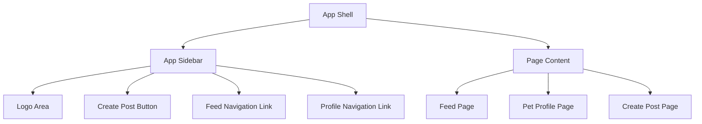

# App Sidebar System

This document describes the design and implementation plan for the **App Sidebar** in Petstok.

The goal of this feature is to implement a reusable application navigation layout inspired by short-video platforms such as TikTok. The sidebar will provide consistent navigation across the core application pages.

The sidebar is part of the **App Shell**, which wraps all primary application screens and ensures that navigation remains visible and consistent.

---

## Feature Goal

The App Sidebar should allow users to:

- navigate to the main feed
- access the create post flow
- navigate to the pet profile page
- understand the application structure through persistent navigation

The design should remain **minimal and structural**, allowing future expansion without requiring layout refactoring.

---

## Scope

### In Scope

The sidebar will include:

- application logo area
- primary **Create Post** button
- navigation link to **Feed**
- navigation link to **Profile**
- layout container for page content
- reusable app shell structure

### Out of Scope

The following features are intentionally excluded:

- notifications
- search input
- following accounts list
- activity indicators
- responsive sidebar collapse behavior
- route highlighting animations
- settings and preferences section
- authentication logic
- analytics or counters

---

## App Shell Architecture

The sidebar is part of the global application layout.

## Layout Structure

AppShell
├─ AppSidebar
│   ├─ Logo
│   ├─ CreatePostButton
│   ├─ FeedLink
│   └─ ProfileLink
│
└─ AppContent
└─ Page Content

The sidebar should remain persistent while the page content updates.

---

## Navigation Targets

The sidebar links to the primary routes of the application.

### Feed

Main video discovery page.

Example route:
/create

The create page renders:

### VideoUrlUploadPanel

This panel allows creators to submit a video URL that will later be processed into a post.

---

### Profile

Navigates to the pet profile page.

Example route:
/profile/[petId]

This page contains:

- pet profile header
- videos grid
- future creator tools

---

## UI Structure

The sidebar follows a simple vertical hierarchy.

Sidebar
├─ Logo
├─ Create Post Button
├─ Navigation
│   ├─ Feed
│   └─ Profile

The **Create Post button** should be visually prominent to encourage content creation.

---

## Rendering Strategy

The sidebar should follow these principles.

### Server Component First

The sidebar should be implemented as a **React Server Component** unless interactivity becomes necessary.

### Static Navigation

Navigation items should remain static in the first implementation.

### Layout Reuse

The sidebar must be reusable across all pages that belong to the main application shell.

---

## Implementation Plan

The feature should be implemented in the following order.

### Step 1

Create the **AppShell layout component**.

Includes:

- sidebar container
- page content container

---

### Step 2

Create the **AppSidebar component**.

Includes:

- logo
- create post button
- navigation links

---

### Step 3

Connect navigation links to application routes.

Includes:

- feed route
- profile route
- create post route

---

### Step 4

Wrap application pages with the AppShell.

Includes:

- feed page
- profile page
- create page

---

## Performance Considerations

The sidebar is part of the global layout and should follow lightweight rendering principles.

Key considerations:

- avoid unnecessary client state
- keep navigation items static
- prevent unnecessary layout re-renders
- maintain stable layout during page transitions

---

## Definition of Done

The feature is complete when:

- the app shell renders correctly
- the sidebar displays the logo
- the create post button is visible
- navigation links to feed and profile work
- page content renders inside the layout
- the layout is reusable across multiple pages
- the layout works correctly within the mobile-first container constraints
