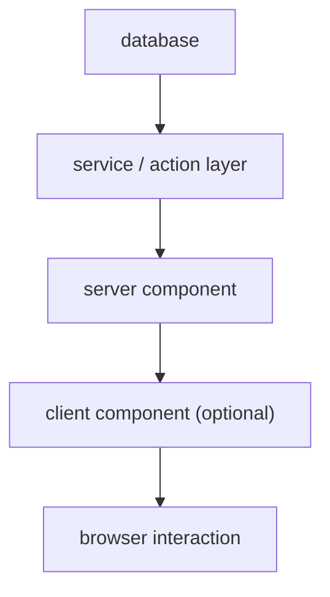
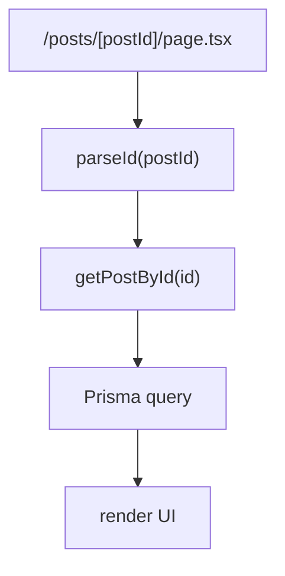
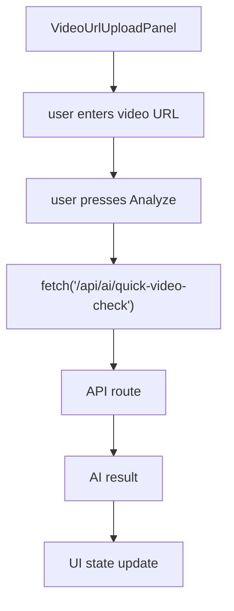
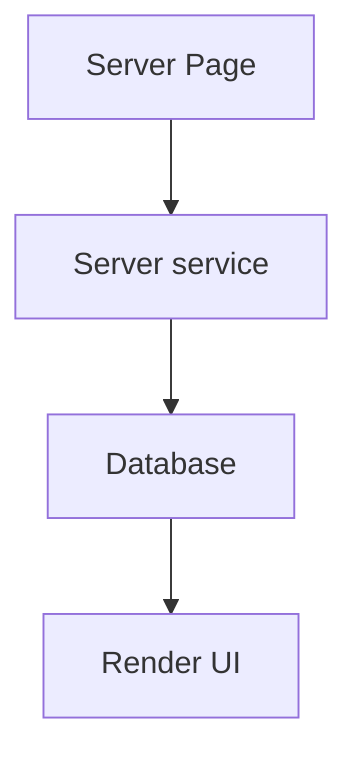
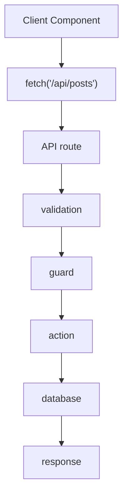
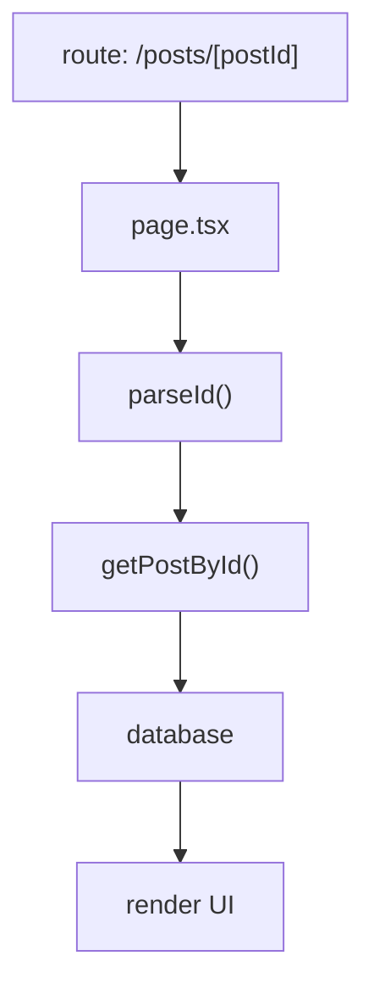

# Rendering

This document describes how UI rendering works in the project and defines the rules for choosing between Server Components, Client Components, and API routes.

The project uses **Next.js App Router with a server-first rendering strategy**.

The goal is to keep most logic on the server while sending the smallest possible JavaScript bundle to the browser.

---

## Core Principle

Rendering should follow this rule:

**Server prepares the data.  
Client handles interaction.**

Server Components are responsible for data access and page composition.

Client Components exist only when the browser must manage state or user interaction.

---

## Rendering Layers

The application rendering flow follows this hierarchy.



Each layer has a specific responsibility.

---

## Server Rendering

Server Components are the default rendering mechanism.

They are responsible for:

- fetching data
- calling server services
- querying the database
- preparing UI data
- rendering layout and structure

Example server rendering flow:



The page receives fully prepared data and renders the interface.

No client fetching is required.

---

## Client Rendering

Client Components exist only when the UI requires interaction.

Typical cases include:

- input fields
- form submission
- button clicks
- loading indicators
- modal dialogs
- toggles
- local UI state

Example interaction flow:



Client Components should remain **small and focused**.

---

## Data Fetching Strategy

Data fetching should happen on the server whenever possible.

Preferred approach:



Avoid fetching data from the client when the page can access the server directly.

This reduces latency and complexity.

---

## Shared Server Services

Database queries should live in shared server services.

Example:

```text
getPostById(id)
```

This function can be reused by:

- server pages
- API routes
- background jobs
- future workers

This prevents duplicated database logic.

---

## API Routes

API routes are used when the request originates from the browser.

Typical use cases include:

- form submissions
- AI analysis requests
- creating posts
- mutations

Example flow:



Server Components should not call API routes if the same logic exists as a server service.

---

## Rendering a Post Page

The post page is rendered entirely on the server.

Flow:



The page displays:

- video preview
- title
- pet id
- moderation status
- AI tags
- AI confidence
- AI description

The video preview is rendered using a reusable UI component.

---

## Video Rendering

Videos are rendered through the `Preview` component.

Responsibilities:

- enforce aspect ratio
- apply consistent styling
- manage video attributes

Example attributes:

- controls
- playsInline
- preload="metadata"

The component does not contain business logic.

---

## Error Rendering

Rendering should handle failure cases explicitly.

Possible states include:

- invalid ID
- post not found
- failed AI request
- invalid video URL

Errors should display a clear UI state rather than silently failing.

---

## Performance Strategy

Rendering performance is achieved by:

- server-side data fetching
- minimizing client JavaScript
- avoiding global client state
- reusing server services

Video components should avoid unnecessary autoplay or large preload sizes.

---

## Anti-Patterns

Avoid the following patterns:

- fetching server data inside client components unnecessarily
- duplicating database queries across files
- placing business logic inside UI components
- storing server data in React state

These patterns lead to harder debugging and scaling issues.

---

## Future Rendering Improvements

Possible future enhancements:

- feed page with infinite scroll
- lazy-loaded video players
- server pagination
- background AI processing updates

All improvements should maintain the server-first architecture.

---

## Rendering Decision Rules

Use the following rules when deciding where logic should live.

Server Components:

- fetch data
- query database
- prepare UI structure

Client Components:

- manage user interaction
- manage local UI state
- trigger browser requests

API routes:

- handle browser requests
- process mutations
- trigger AI pipelines

Database access should always remain on the server.
