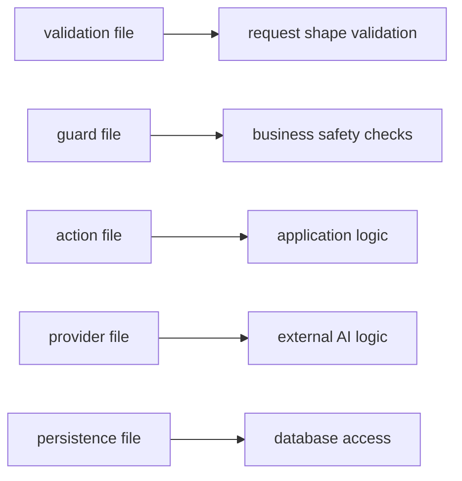

# Project Rules

These rules ensure code consistency, maintainability, and predictable architecture across the project.

---

## TypeScript Rules

- Do not use `any`
- Prefer explicit types
- Prefer shared types from domain modules
- Avoid duplicating type definitions
- Prefer `type` for domain objects and API contracts

Example:

```text
type PostDetails = {
  id: number
  videoUrl: string
  title?: string
}
```

---

## Function Rules

Prefer arrow functions.

Correct:

```text
const createPost = async () => {}
```

Avoid:

```text
function createPost() {}
```

Arrow functions maintain consistent style and reduce context confusion.

---

## File Responsibilities

Each file should have a single responsibility.

Examples:



This keeps layers predictable and easy to reason about.

---

## Server vs Client

Client Components should only handle:

- UI interaction
- local state
- browser APIs
- form submission

Server Components should handle:

- data fetching
- database access
- calling server services
- preparing UI data

Prefer server rendering whenever possible.

---

## API Routes

Routes should remain thin.

Routes should:

- parse request
- validate input
- call action
- return response

Typical structure:

```text
route
→ validation
→ guard
→ action
→ provider
→ persistence
```

Routes must not contain business logic.

---

## Logging

Routes must log:

- request start
- invalid input
- unexpected errors

Providers must log:

- AI invocation
- classification results
- fallback behavior

Logs should help trace issues without exposing sensitive data.

---

## UI Rules

UI components should follow these principles:

- reuse components whenever possible
- avoid duplicated layout patterns
- keep business logic outside UI
- keep components small and focused

Use shared UI primitives for consistent styling.

---

## Error Handling

All failure states should be handled explicitly.

Examples:

- invalid ID
- post not found
- invalid video URL
- failed AI request

Errors should result in a clear UI state rather than silent failure.

---

## Simplicity Rule

If the code cannot be explained clearly in **30 seconds**,  
it is probably too complicated.

Prefer simple, predictable solutions over clever abstractions.
