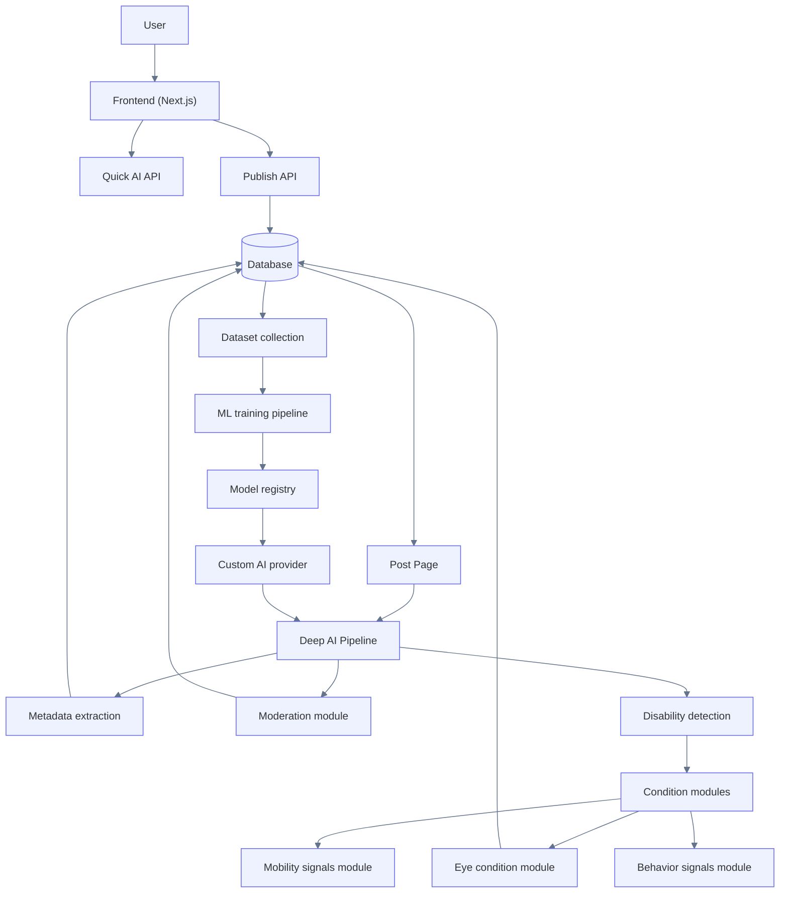
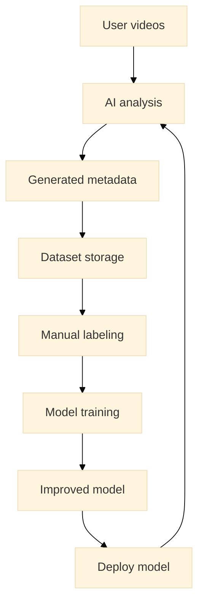

# AI System Design

This document describes the full system architecture for Petstok.

Petstok combines:

- frontend video experience
- backend API
- AI analysis pipelines
- machine learning training infrastructure

The system is designed to evolve from **API-based AI analysis** toward **custom trained models**.

---

## High Level Architecture



---

## System Components

### Frontend

The frontend is responsible for:

- video preview
- upload flow
- running Quick AI checks
- displaying AI metadata
- triggering deep analysis

Technologies:

- Next.js
- React
- server components
- client components

---

### Backend API

Backend routes handle communication between the client and AI services.

Important routes:

```text
POST /api/ai/quick-video-check
POST /api/posts
GET  /api/posts/[postId]
POST /api/posts/[postId]/deep-ai
```

The backend follows layered architecture:

```text
route
↓
validation
↓
guard
↓
action
↓
provider
↓
persistence
```

---

### Quick AI

Quick AI runs **before publishing**.

Purpose:

- provide instant feedback
- generate hashtags
- detect obvious signals

Quick AI characteristics:

- fast
- stateless
- inexpensive

It should never block publishing.

---

### Deep AI

Deep AI runs **after a post is published**.

Purpose:

- analyze video frames
- generate metadata
- detect disability signals
- update database

Deep AI may run:

- manually
- automatically
- as background job

---

## Deep AI Analysis Pipeline


Deep AI does not assume a single fixed disability type.

Instead, it follows a generic pipeline:

1. extract representative frames from the video
2. detect relevant visual regions
3. prepare inputs for analysis
4. run one or more condition-specific analyzers
5. aggregate the results across frames
6. generate structured metadata
7. persist the final metadata to the database

This design allows the system to support:

- eye-condition analysis
- mobility signals
- behavior signals
- future disability-related modules

---

## Data Collection Loop

Petstok continuously collects data to improve AI models.



This creates a **continuous training loop**.

---

## AI Provider Strategy

Petstok uses a staged AI strategy.

### Stage 1

Use general-purpose APIs:

- OpenAI Vision
- other multimodal models

Advantages:

- fast integration
- no dataset required

---

### Stage 2

Collect domain-specific dataset.

The goal is to build a dataset that captures a wide range of visual signals in pet videos.

Possible signals include:

- visible health-related signals
- potential disability indicators
- unusual visual patterns
- behavioral anomalies

The dataset should include:

- different lighting conditions
- different video quality levels
- different camera angles
- different breeds and species

This dataset will later support training specialized computer vision models.

---

### Stage 3

Train specialized models.

Possible architectures:

- YOLO (object detection)
- EfficientNet (classification)
- Vision Transformers

---

## Future Scaling

Future system improvements may include:

### Background Processing

Deep AI may run asynchronously using:

- background workers
- queue systems

Example architecture:

```text
API
→ job queue
→ worker
→ AI pipeline
→ database
```

---

### Real-time AI Feedback

Future UI may include:

- streaming AI responses
- progressive analysis updates
- live metadata updates

---

### Multi-Model AI

The system may run multiple models simultaneously.

Example:

```text
video
→ eye model
→ mobility model
→ behavior model
```

Results are aggregated into a unified analysis result.

---

## Design Principles

Petstok follows several architectural principles.

### Separation of concerns

Each layer has a single responsibility.

### Modular AI architecture

The AI pipeline is designed to support multiple condition-specific analysis modules.

Each module is responsible for detecting a specific category of visual signals.

The first implemented module focuses on eye-related visual signals, but the architecture is designed to support additional modules in the future.

Possible modules may include:

- eye condition signals
- mobility signals
- behavioral signals
- other visible disability indicators

### Gradual AI evolution

The system starts with external AI providers and gradually evolves toward custom-trained models.

### Data-driven improvement

User-generated content contributes to dataset collection, enabling continuous model improvement.
