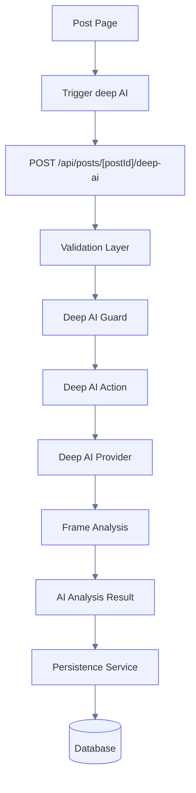
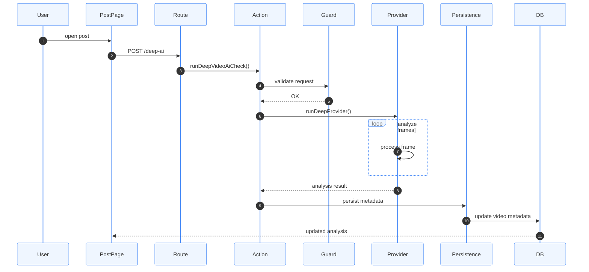
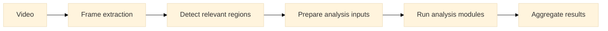
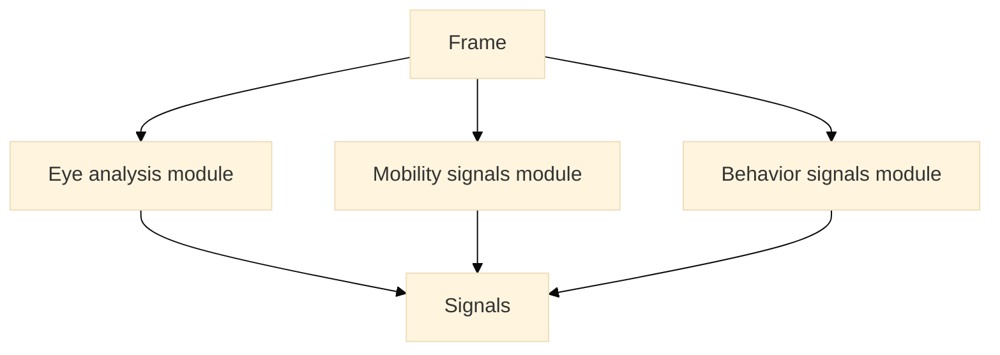

# Deep AI Pipeline

Deep AI performs post-publish analysis of videos.  
Unlike Quick AI, this pipeline runs **after a post is created** and writes persistent metadata to the database.

Deep AI is responsible for:

- metadata enrichment
- moderation signals
- disability detection
- dataset preparation for future ML models

---

## Deep AI Flow



---

## Deep AI Sequence



---

## Frame Analysis Loop

Deep AI analyzes videos frame-by-frame.

Instead of targeting a single condition type, the pipeline is designed to support **multiple visual analysis modules**.

Typical pipeline:

1. extract frames from the video
2. detect relevant visual regions
3. prepare inputs for analysis modules
4. run condition-specific analyzers
5. aggregate results across frames



---

## Analysis Modules

The **analysis modules layer** allows the system to run multiple independent detectors.

Each module analyzes a specific category of visual signals.

Examples of modules include:

- eye condition signals
- mobility signals
- asymmetry detection
- behavioral signals

The system may run multiple modules for the same video.

Example:



---

## Result Aggregation

Since multiple frames and modules are analyzed, the system aggregates results before storing metadata.

Aggregation may include:

- confidence scoring
- signal frequency
- multi-frame validation
- anomaly detection

Example logic:

```text
frame1 → eye signal detected
frame2 → no signal
frame3 → eye signal detected

Final result:
signal: possible_eye_condition
confidence: medium
```

This approach improves robustness when video quality is poor or lighting conditions vary.

---

## Stored Metadata

Deep AI writes results to the `video` table.

Typical fields:

- `aiTags`
- `aiConfidence`
- `aiDescription`
- `moderationStatus`
- `moderationReason`

Example structure:

```text
video
 ├─ postId
 ├─ aiTags
 ├─ aiConfidence
 ├─ aiDescription
 ├─ moderationStatus
 └─ moderationReason
```

---

## Deep AI Design Principles

Deep AI must be:

- deterministic
- modular
- extensible

The pipeline should allow adding new analysis modules without changing the core flow.

Examples of future modules:

- eye condition detection
- mobility impairment detection
- asymmetry analysis
- behavioral signals
