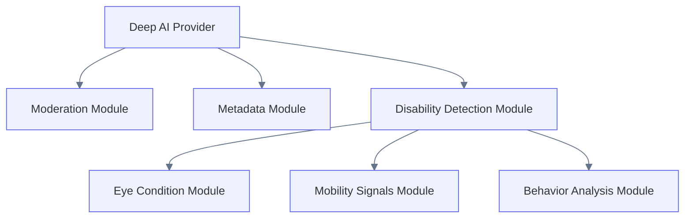
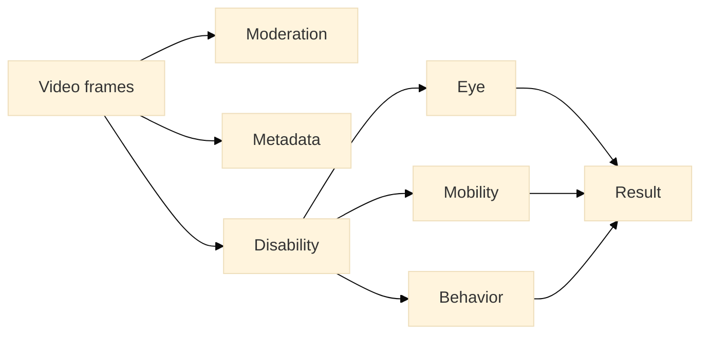

# Disability Detection Modules

Petstok is designed to support **modular disability detection**.

Instead of building a single monolithic AI system, the platform uses **separate detection modules** that can analyze different types of disabilities.

This architecture allows the system to evolve as new models become available.

---

## Module Architecture



---

## Module Responsibilities

### Moderation Module

Responsible for detecting restricted or unsafe content.

Outputs:

- moderationStatus
- moderationReason

Possible values:

```text
PENDING
APPROVED
REJECTED
FLAGGED
```

---

### Metadata Module

Responsible for generating video metadata.

Outputs:

- aiTags
- aiConfidence
- aiDescription

Example:

```text
tags: ["cat", "sleeping", "cute"]
confidence: 0.91
description: "A sleepy cat resting on a couch"
```

---

### Disability Detection Module

Responsible for identifying possible disability signals.

This module aggregates specialized detectors.

Outputs may include:

- disabilityType
- severityScore
- anomalySignals

Example:

```text
disabilityType: eye_condition
severityScore: 0.72
signals: ["cloudy_eye", "closed_eye"]
```

---

## Eye Condition Module

The first implemented disability detector focuses on **eye health**.

Purpose:

Detect possible visual impairment.

Signals may include:

- cloudy eye
- permanently closed eye
- asymmetry between eyes
- light reflection anomalies

Example output:

```text
condition: cataract_possible
confidence: 0.78
signals: ["cloudy_eye"]
```

---

## Future Modules

The architecture allows adding new detectors without modifying the Deep AI pipeline.

Possible future modules:

### Mobility Signals

Detect issues with movement.

Examples:

- limping
- unstable walking
- reduced movement

---

### Behavioral Signals

Detect unusual behavior patterns.

Examples:

- disorientation
- repetitive movement
- avoidance behavior

---

### Vision Tracking

Analyze eye movement and focus.

Examples:

- delayed tracking
- non-responsive gaze
- directional blindness

---

## Module Execution Flow



All module outputs are aggregated into the final **Deep AI result**.

---

## Design Principles

Disability modules must be:

- independent
- replaceable
- testable
- model-agnostic

Each module should:

1. accept frames or cropped regions
2. return structured signals
3. avoid direct database access

The Deep AI pipeline is responsible for **aggregating module outputs and persisting results**.
