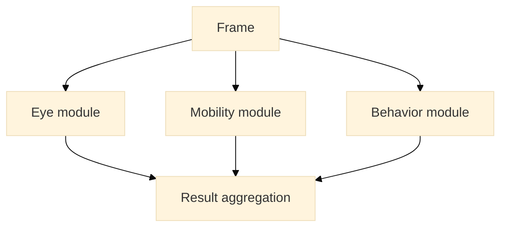

# ML Modules

This document describes the modular machine learning architecture planned for Petstok.

The AI system is designed to support **multiple specialized analysis modules** that detect different visual signals in pet videos.

Each module focuses on a specific class of observable signals.

Modules operate independently but share the same **video processing pipeline**.

---

## Purpose of ML Modules

ML modules allow the system to analyze different aspects of a video without coupling all logic into a single model.

Benefits:

- modular AI architecture
- easier experimentation
- independent model updates
- better dataset specialization
- improved explainability

Instead of a single large model, the system can run multiple specialized analyzers.

---

## Shared Video Analysis Pipeline

All modules use the same base pipeline.


Each module receives relevant frame data and produces **module-specific signals**.

---

## Module Categories

Modules can be grouped by the type of visual signals they analyze.

Possible categories include:

- health-related visual signals
- disability indicators
- behavior signals
- mobility signals
- structural asymmetry signals

Each category may contain multiple models.

---

## Eye Condition Module

The first specialized module focuses on **eye-related visual signals**.

Possible detected signals include:

- cloudy eye
- partially closed eye
- abnormal reflection
- asymmetry between eyes
- possible vision impairment indicators

Example output:

```text
signal: possible_eye_condition
confidence: 0.72
region: eye
```

This module is the initial proof-of-concept for the system.

---

## Mobility Signals Module

This module analyzes body posture and movement patterns.

Possible signals:

- limping
- unstable walking
- reduced movement
- abnormal posture

Example output:

```text
signal: mobility_irregularity
confidence: 0.61
region: body
```

This module would require frame sequences rather than single-frame analysis.

---

## Behavioral Signals Module

This module analyzes behavioral patterns visible in video.

Possible signals:

- repetitive behavior
- abnormal stillness
- distress indicators
- unusual gaze patterns

Example output:

```text
signal: behavioral_anomaly
confidence: 0.55
region: full_frame
```

Behavior analysis may rely on temporal analysis across frames.

---

## Asymmetry Detection Module

Some conditions manifest as asymmetry.

This module compares symmetrical regions of the body.

Possible signals:

- eye asymmetry
- head tilt
- uneven posture

Example output:

```text
signal: structural_asymmetry
confidence: 0.67
```

---

## Module Execution Strategy

Modules may run:

- sequentially
- in parallel
- conditionally based on detected regions

Example strategy:



Not every module needs to run on every frame.

---

## Result Aggregation

Signals from multiple frames and modules must be aggregated.

Aggregation may include:

- signal frequency
- confidence scoring
- cross-frame validation
- module prioritization

Example logic:

```text
frame1 → eye signal detected
frame2 → eye signal detected
frame3 → no signal

Final result:
signal: possible_eye_condition
confidence: medium
```

---

## Metadata Output

Module outputs are converted into structured metadata.

Example stored metadata:

```text
video
 ├─ aiTags
 ├─ aiDescription
 ├─ aiConfidence
 ├─ moderationStatus
 ├─ moderationReason
 └─ signals
```

Signals may later include:

```text
signals
 ├─ eye_condition
 ├─ mobility_irregularity
 └─ behavioral_anomaly
```

---

## Future Module Expansion

The architecture allows new modules to be added without modifying the core pipeline.

Future modules may include:

- respiratory signals
- pain indicators
- grooming abnormalities
- interaction behavior

The system is designed to evolve as datasets and models improve.

---

## Design Principle

The ML system follows a **modular analyzer architecture**.

Instead of a single monolithic model, Petstok runs **multiple specialized detectors** that contribute signals to a unified analysis result.

This approach allows the platform to expand gradually while improving detection accuracy over time.
