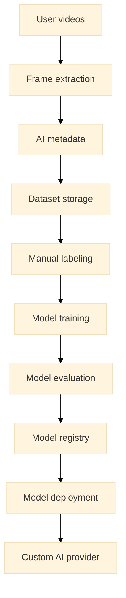
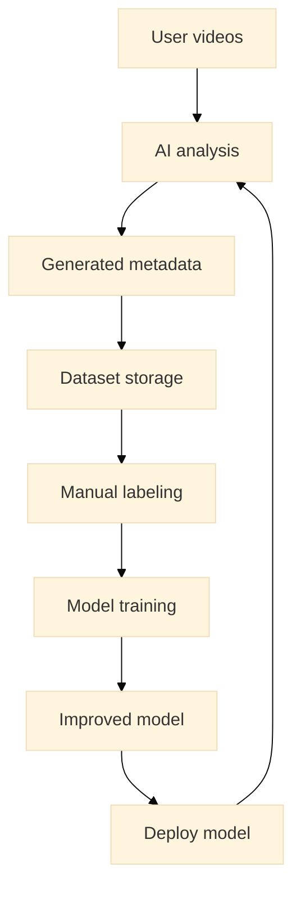

# ML Pipeline

This document describes the machine learning pipeline used to train and improve AI models in Petstok.

The ML pipeline is responsible for transforming user-generated video content into datasets that can be used to train specialized computer vision models.

The pipeline supports a modular AI architecture where different models detect different visual signals.

---

## ML System Overview



The ML pipeline continuously improves models using real-world data collected from the platform.

---

## Data Sources

The primary data source is user-generated video content.

Sources include:

- user-uploaded videos
- extracted frames
- AI-generated metadata
- manual annotations

Collected data helps build a domain-specific dataset for training models.

---

## Frame Extraction

Videos are converted into frame samples.

Frame extraction allows models to analyze individual visual moments rather than entire video files.

Typical steps:

1. sample representative frames
2. detect relevant visual regions
3. prepare frames for labeling or training

Example:

```text
video
→ frame1
→ frame2
→ frame3
```

Frames may later be grouped into sequences for temporal analysis.

---

## Metadata Collection

AI pipelines generate metadata that helps organize training data.

Examples include:

```text
aiTags
aiConfidence
aiDescription
moderationStatus
visual signals
```

Metadata can help:

- filter useful training samples
- prioritize labeling tasks
- detect interesting edge cases

---

## Dataset Storage

Frames and metadata are stored in dataset storage.

The dataset typically contains:

```text
image/frame
metadata
labels
bounding boxes
annotations
```

Dataset storage should support:

- versioning
- dataset splits
- label updates

External dataset management tools may be used.

Example tools:

- Roboflow
- custom dataset storage
- cloud object storage

---

## Labeling

Manual labeling improves dataset quality.

Labeling tasks may include:

- marking regions of interest
- identifying visual signals
- assigning condition labels
- validating AI-generated metadata

Example labels:

```text
healthy
suspicious
possible_condition
uncertain
```

Labeling may be performed by:

- internal reviewers
- community moderators
- dataset specialists

---

## Model Training

Training transforms labeled datasets into machine learning models.

Possible model types include:

- classification models
- object detection models
- multi-label classification models
- temporal analysis models

Training environments may include:

- Google Colab
- GPU cloud environments
- local training pipelines

Example training workflow:

```text
dataset
→ preprocessing
→ training
→ validation
→ model artifact
```

---

## Model Evaluation

Trained models must be evaluated before deployment.

Evaluation metrics may include:

- precision
- recall
- F1 score
- false positive rate
- confidence calibration

Evaluation ensures models behave reliably before being used in production.

---

## Model Registry

Trained models should be stored in a model registry.

The registry tracks:

- model versions
- training datasets
- evaluation metrics
- deployment status

Example structure:

```text
model_registry
 ├─ model_version
 ├─ dataset_version
 ├─ metrics
 └─ deployment_status
```

---

## Model Deployment

Once validated, models can be deployed to production.

Deployed models may run inside:

- inference services
- AI provider layers
- specialized GPU inference environments

Deployment connects trained models to the **Deep AI pipeline**.

---

## Continuous Learning Loop

Petstok improves models through continuous feedback.



This loop allows models to improve as more data becomes available.

---

## Relationship With ML Modules

The ML pipeline trains models used by the **analysis modules** described in `ML_MODULES.md`.

Each module may have its own:

- dataset
- labels
- training configuration
- evaluation criteria

Examples:

```text
eye_condition module
mobility module
behavior module
```

The modular structure allows independent model evolution.

---

## Long-Term Goal

The long-term goal is to transition from generic AI APIs to specialized models trained on Petstok datasets.

This allows the platform to detect subtle visual signals that generic models cannot reliably identify.
