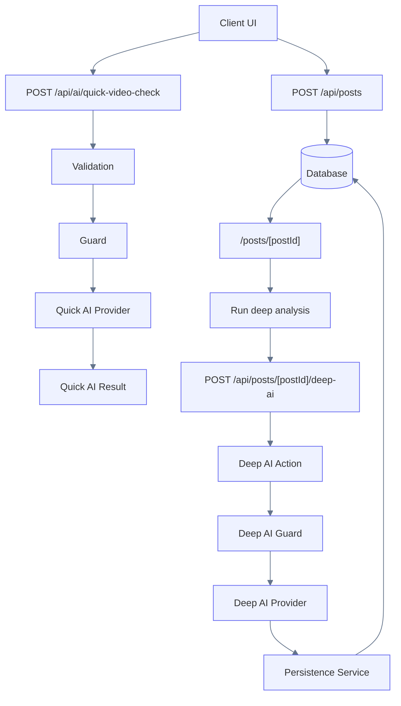

# AI Architecture Overview

This document describes the high level AI architecture used in Petstok.

The system separates **Quick AI** (pre-publish analysis) and **Deep AI** (post-publish analysis).

Quick AI helps the user **before publishing**, while Deep AI performs **persistent analysis and disability detection**.

---

## System Architecture

---

## Key Concepts

### Quick AI

Runs before publishing.

Purpose:

- provide immediate feedback
- generate suggested hashtags
- detect basic anomalies

Quick AI **does not persist results**.

---

### Deep AI

Runs after a post is created.

Purpose:

- persistent metadata analysis
- moderation signals
- disability detection
- dataset collection

Deep AI **writes results to the database**.
