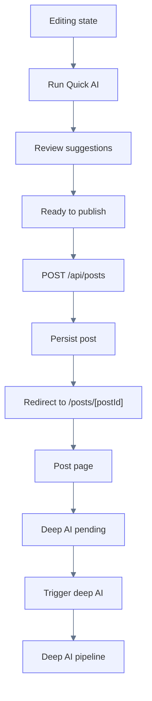
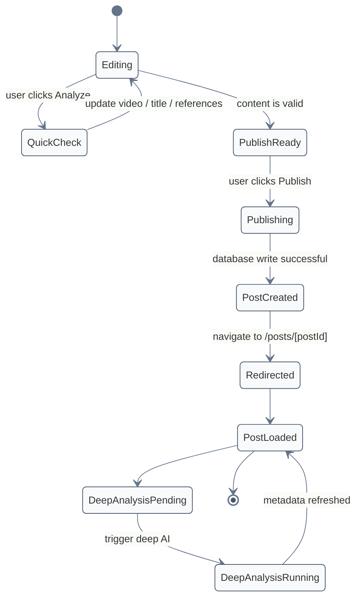
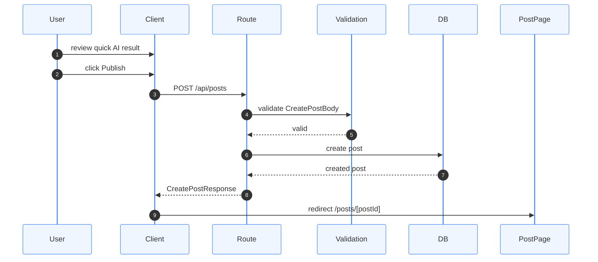

# Publish Flow

This document describes how publishing works in Petstok and how it connects the **Quick AI** and **Deep AI** pipelines.

Publishing is the transition point between:

- temporary user-side analysis
- persistent post creation
- future post-publish AI enrichment

Quick AI runs before publishing and helps the user prepare content.

Deep AI runs after publishing and enriches the stored video metadata.

---

## Publish Lifecycle Overview



---

## State Transition Flow



---

## Request Flow

Publishing begins in the client UI and continues through the backend.



---

## Responsibilities of the Publish Step

Publishing is responsible for:

- creating the post
- storing videoUrl
- storing title
- storing petId
- redirecting the user to the post page

Publishing is **not responsible** for:

- full AI moderation
- deep metadata extraction
- disability signal analysis
- frame-by-frame processing

These belong to the **Deep AI pipeline**.

---

## Relationship Between Quick AI and Publish

Quick AI helps the user before publishing.

Typical Quick AI outputs may include:

- suggested hashtags
- rough animal classification
- anomaly hints
- lightweight confidence signals

Quick AI outputs are:

- temporary
- user-facing
- non-persistent by default

Quick AI should not block publish unless the product later introduces hard validation rules.

---

## Relationship Between Publish and Deep AI

Publishing creates the persistent entity.

Once the post exists, the system can run deeper analysis because:

- the content now has a stable identifier
- metadata can be stored in the database
- deeper AI can enrich the `video` entity

This means publish acts as the bridge between:

```text
temporary pre-publish analysis
→ persistent post lifecycle
→ post-publish AI enrichment
```

---

## Persisted Entities

At publish time, the system stores the post-level data.

Typical persisted fields:

```text
post
 ├─ id
 ├─ title
 ├─ videoUrl
 └─ petId
```

Later, Deep AI enriches the related `video` entity with persistent metadata.

Example future structure:

```text
video
 ├─ postId
 ├─ aiTags
 ├─ aiConfidence
 ├─ aiDescription
 ├─ moderationStatus
 └─ moderationReason
```

---

## Publish Design Principles

The publish flow should remain:

- simple
- deterministic
- fast
- independent from heavy AI operations

The user should be able to publish content without waiting for expensive post-processing.

Deep AI should be treated as a separate enrichment step.

---

## Future Improvements

Possible future improvements to the publish flow include:

- explicit hashtag acceptance before publish
- draft support
- publish validation rules
- async deep AI trigger after publish
- publish success UI with background analysis status

The flow should continue to keep **post creation** and **deep analysis** separate.
