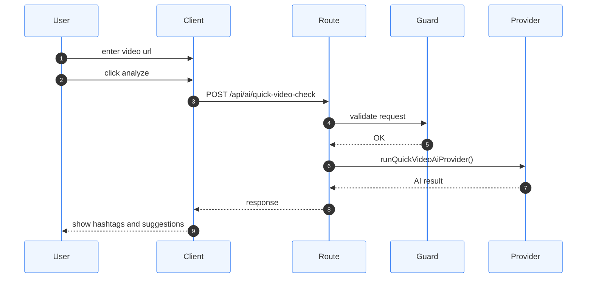

# Quick AI Sequence

Quick AI runs before publishing and helps the user understand the video.

---

## Request Flow

---

## Responsibilities

Quick AI performs:

- animal classification
- hashtag suggestion
- basic anomaly hints

Quick AI should remain:

- fast
- inexpensive
- stateless
