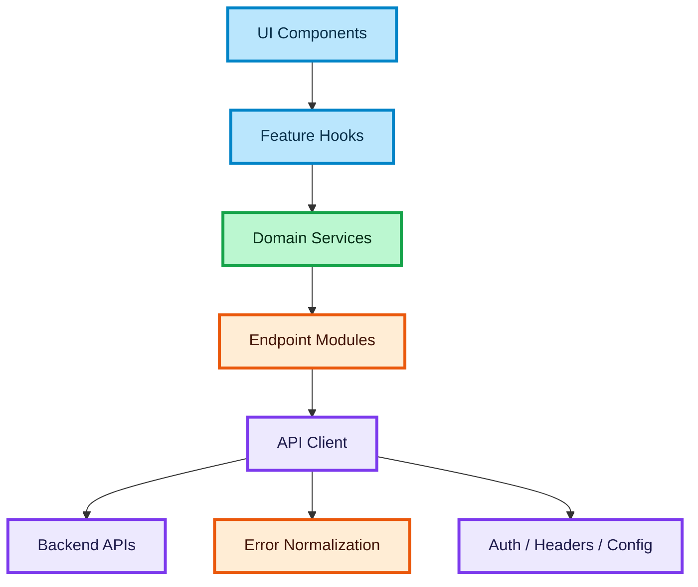

# API Layer Design for a Scalable Frontend

## Purpose

This document defines how to structure the API layer in a frontend application that depends on multiple backend integrations, async business flows, and high-volume user interactions.

The goal is to make data access predictable, reusable, and independent from UI components.

---

## Why This Layer Matters

In API-heavy products, the frontend often becomes unstable when components call backend endpoints directly.

Typical problems:

- duplicated request logic
- inconsistent error handling
- different data shapes across components
- hardcoded endpoint details in UI
- difficult testing
- poor reuse across features

A dedicated API layer solves this by introducing a stable boundary between the frontend feature logic and backend transport logic.

---

## Design Goals

### Separation of concerns

The API layer should isolate transport details from business logic and presentation.

### Reusability

The same endpoint access pattern should be reusable across multiple features.

### Type safety

Requests and responses should be typed and consistent.

### Centralized resilience

Retry behavior, auth headers, and error normalization should not be reimplemented in every feature.

### Scalability

New endpoints and integrations should be added without coupling them to component trees.

---

## Recommended Layer Structure

A scalable frontend should separate API access into three levels:

- API client
- endpoint modules
- domain services

---

## API Client

The API client is the lowest-level transport abstraction.

Responsibilities:

- perform HTTP requests
- attach headers
- include auth tokens
- handle base URL
- normalize network errors
- support request cancellation

The API client should know:

- how to send requests
- how to parse responses
- how to handle generic transport failures

The API client should not know:

- what a booking flow is
- what a search screen does
- how the UI behaves

---

## Endpoint Modules

Endpoint modules define feature-oriented backend access.

Responsibilities:

- group related endpoint calls
- keep URL paths in one place
- define request and response contracts
- map raw endpoints into readable API functions

Examples:

- search endpoints
- booking endpoints
- payment endpoints
- user profile endpoints

This layer is still transport-oriented, but more readable than raw request code.

---

## Domain Services

Domain services orchestrate feature use cases on top of endpoint modules.

Responsibilities:

- combine multiple endpoint calls
- transform data into domain-friendly shapes
- apply frontend business rules
- hide backend complexity from hooks and components

Examples:

- build search result model
- prepare booking payload
- coordinate booking confirmation flow
- decide whether retry is safe

This is the first layer that should speak in product language instead of backend route language.

---

## Suggested Responsibility Split

### UI layer

- triggers actions
- renders states

### Hooks layer

- coordinates feature state
- calls services
- exposes query and mutation state

### Service layer

- contains business-oriented orchestration

### API layer

- contains request and response access logic

This split prevents components from turning into mini-backends.

---

## Request Lifecycle Model

A healthy API layer should support the full request lifecycle.

### Request construction

Build request using:

- endpoint path
- method
- params
- body
- headers
- cancellation signal

### Request execution

Send through shared API client.

### Response parsing

Normalize server payload into typed frontend shape.

### Error normalization

Convert backend and network errors into predictable application-level error objects.

---

## Error Handling Strategy

Error handling should be centralized as much as possible.

The API layer should distinguish:

- network error
- timeout
- unauthorized
- forbidden
- validation error
- server error
- unknown error

Frontend features should not need to guess what kind of failure happened.

A normalized error model makes retry, fallback UI, and logging more consistent.

---

## Retry Strategy

Retries belong partly in infrastructure and partly in feature logic.

Good default rules:

- retry safe reads
- do not blindly retry unsafe mutations
- allow feature-specific retry decisions in services

Examples:

- search request can retry automatically
- booking creation should retry only if idempotency is guaranteed
- payment retry must be backend-driven

---

## Cancellation Strategy

Cancellation is critical in async frontend systems.

The API layer should support cancellation for:

- outdated search queries
- filter changes
- screen unmount
- replaced requests

Rule:

A cancelled request must not update visible state.

---

## Data Mapping Strategy

Do not leak raw backend payloads into UI.

Instead:

- endpoint layer handles raw response contract
- service layer maps response into domain shape
- UI consumes domain shape

This reduces coupling to backend changes.

Example:

The backend may return transport-heavy fields, but the UI should receive only what is relevant for rendering and feature decisions.

---

## Auth and Headers

Auth should be handled centrally.

The API layer should be able to:

- attach bearer token or session credentials
- include locale or market headers when needed
- attach correlation IDs if supported
- keep auth handling out of components

This is especially important in white-label or multi-market systems.

---

## Observability Considerations

A production-ready API layer should support observability.

Useful signals:

- request duration
- endpoint failures
- retry count
- cancellation count
- status code distribution

This helps diagnose problems in high-load or integration-heavy products.

---

## White-Label Considerations

In a white-label product, API behavior may differ by client, market, or feature availability.

The API layer should support:

- config-driven base paths if required
- market-specific headers
- feature availability checks
- partner-specific request shaping only when truly necessary

Rule:

Do not spread partner-specific branching across components.

---

## Testing Strategy

The API layer should be easy to test in isolation.

Recommended test coverage:

- API client error normalization
- endpoint request construction
- service data mapping
- retry and cancellation behavior

This reduces the need to test transport details through UI tests.

---

## Anti-Patterns

### Direct fetch inside components

This creates duplication and tightly couples UI to backend details.

### Mixing transport logic with business logic

Do not combine endpoint URLs and booking rules in the same place.

### Returning raw server responses to UI

This leaks backend contracts into presentation code.

### Repeating error parsing everywhere

Error handling should not be rewritten across hooks and components.

### Shared “god service”

A single huge API file becomes hard to navigate and impossible to scale.

---

## Senior-Level Principles

### Treat the API layer as an architectural boundary

It is not just utility code. It defines how frontend talks to the rest of the system.

### Keep transport boring

The lower the layer, the simpler and more predictable it should be.

### Put business meaning above endpoints

Hooks and components should work with search results, bookings, and payment state — not raw request details.

### Centralize instability

Network volatility, retries, auth, and error parsing should live close to the API boundary.

---

## Example Structure

A practical structure might look like this:

- `lib/api/client`
- `lib/api/endpoints`
- `features/search/services`
- `features/booking/services`
- `features/payment/services`

The exact naming can vary, but the boundary should remain clear.

---

## Interview Framing

Use this document when answering:

- How would you structure API access in a React application?
- How do you keep components decoupled from backend details?
- How do you handle retries and errors in API-heavy systems?
- How do you design frontend architecture for multiple integrations?

Strong answer structure:

- define the API boundary
- explain layer split
- mention type safety and mapping
- cover retries, cancellation, and normalized errors
- explain why UI should stay decoupled

---

## Summary

A strong API layer should provide:

- centralized request execution
- typed endpoint access
- domain-oriented services
- normalized error handling
- retry and cancellation support
- clean separation from UI

This design makes the frontend more scalable, testable, and reliable in API-heavy systems.

---

### 🎨 Legend

| Color | Meaning |
| :--- | :--- |
| 🔵 **Blue** | Client / UI layer |
| 🟣 **Purple** | Server / infrastructure |
| 🟢 **Green** | Data flow / logic |
| 🟠 **Orange** | State / cache |
| 🔴 **Red** | Failure / rollback |
