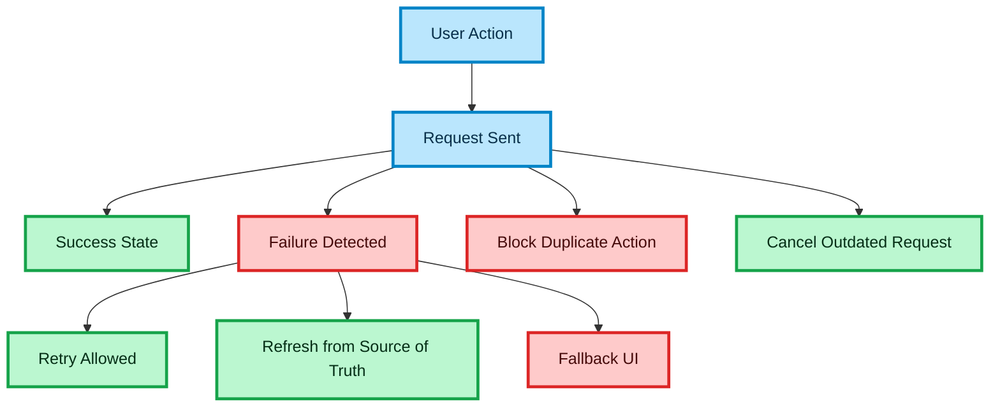

# Error Handling and Resilience for API-Heavy Frontend Systems

## Purpose

This document defines how to design frontend systems that remain predictable under failure.

The goal is to make async product flows resilient when backend APIs, network conditions, or third-party providers behave unpredictably.

This is especially important for:

- search flows
- booking flows
- payment flows
- white-label integrations
- high-volume API-heavy systems

---

## Why This Matters

In production systems, success paths are only part of the architecture.

Real systems fail because of:

- slow networks
- partial backend outages
- third-party API instability
- invalid or stale data
- user retries
- duplicate submissions
- inconsistent state between client and server

A senior frontend engineer should design for these conditions from the start.

---

## Resilience Goals

### Predictable failure states

The UI should always move into a clear and explainable state.

### Safe recovery

Users should be able to retry or continue without corrupting the flow.

### Scope isolation

A failure in one step should not necessarily break the entire product journey.

### Backend truth preservation

The frontend must not invent success when the backend has not confirmed it.

### Minimal user frustration

Failure handling should preserve as much progress and context as possible.

---

## Core Failure Types

## Network Failure

The request cannot complete because of connectivity issues.

Examples:

- offline connection
- unstable mobile network
- DNS or transport issue

Frontend expectation:

- show retry path
- preserve user context
- do not wipe previous successful state unless needed

---

## Timeout

The request did not complete in an acceptable time window.

Examples:

- slow provider
- overloaded backend
- stuck payment confirmation

Frontend expectation:

- show pending or timeout state
- avoid infinite spinner
- allow safe retry when applicable

---

## Validation Failure

The backend rejected input because request data is invalid.

Examples:

- missing required field
- stale selection
- invalid booking payload

Frontend expectation:

- show actionable feedback
- do not retry automatically
- keep user near the failed input

---

## Business Conflict

The request is syntactically valid, but business rules reject it.

Examples:

- unavailable inventory
- expired quote
- booking no longer valid
- payment state conflict

Frontend expectation:

- explain what changed
- allow user to reselect or refresh state
- do not pretend this is a technical error

---

## Unauthorized or Forbidden

The request failed because the user session or permissions are invalid.

Examples:

- expired session
- missing access rights
- market restriction

Frontend expectation:

- redirect or request re-auth when appropriate
- avoid ambiguous generic error state

---

## Third-Party Provider Failure

A downstream integration failed even if your backend is still reachable.

Examples:

- payment provider unavailable
- schedule provider timeout
- external API returns invalid data

Frontend expectation:

- communicate uncertainty clearly
- wait for backend-confirmed status when necessary
- avoid duplicate action spam from the user

---

## Unknown Server Error

The backend responded with a generic failure.

Frontend expectation:

- show safe fallback
- log the event
- allow retry only if operation is safe

---

## Failure Design Principles

### Fail explicitly

Never hide failure behind silent fallback unless the action is truly optional.

### Preserve context

Keep query, selection, and user progress whenever possible.

### Separate display from cause

User-facing messaging should be clear, even when technical details are more complex internally.

### Keep recovery paths visible

A failed state without a next action creates frustration and drop-off.

### Distinguish recoverable and terminal failures

Not every failure should show the same retry behavior.

---

## Recovery Strategies

## Retry

Use retry only when the operation is safe.

Good examples:

- fetching search results
- refetching profile data
- loading page metadata

Be careful with:

- booking creation
- payment submission
- any mutation with side effects

Rule:

Retry should be tied to operation safety, not to developer convenience.

---

## Refresh from Source of Truth

Some flows should not retry the exact same local assumption.

Examples:

- booking quote may be outdated
- payment status may need backend recheck

Strategy:

- refetch canonical backend state
- rebuild UI from fresh data

---

## Fallback UI

Fallback UI should preserve trust.

Examples:

- partial page still usable
- retry call to action
- state preserved while recovering

Bad fallback:

- blank screen
- endless spinner
- generic “something went wrong” with no action

---

## Graceful Degradation

Some features are optional enough to degrade safely.

Examples:

- recommendation widget fails
- analytics tracking fails
- secondary metadata panel fails

Strategy:

- keep primary flow alive
- isolate non-critical failure

---

## Idempotency Awareness

Frontend resilience depends on backend guarantees.

Important concept:

Some actions are safe to repeat, others are not.

Examples:

### Usually safe to repeat

- GET search
- GET booking status

### Potentially unsafe to repeat

- create booking
- confirm payment
- finalize order

Senior principle:

The frontend should know when repeated submission may create duplicate side effects.

---

## Duplicate Submission Protection

Users retry aggressively when the UI looks stuck.

The frontend should protect critical mutations by:

- disabling duplicate submission while pending
- showing explicit pending state
- respecting backend idempotency contracts
- preventing double-click side effects

---

## Partial Failure Handling

Not all failures should collapse the entire journey.

Examples:

- search succeeded, filter metadata failed
- booking succeeded, confirmation UI refetch failed
- payment initiated, final status temporarily unknown

Strategy:

- isolate failure to the affected area
- preserve the rest of the flow
- show next safe action

This is a strong senior signal because distributed systems rarely fail in a fully binary way.

---

## Cancellation Strategy

Cancellation improves both correctness and UX.

Use cancellation when:

- user updates query quickly
- filter changes invalidate old request
- screen unmounts
- newer request supersedes older request

Rule:

A cancelled request must never update visible state.

This prevents stale data and race-condition bugs.

---

## Stale Data Protection

Some failures are really consistency problems.

Examples:

- user selects a stale result
- price changed before submit
- availability changed between search and booking

Frontend strategy:

- treat critical confirmation steps as fresh reads or guarded mutations
- never assume search result guarantees booking validity

---

## Recommended Error Model

A strong frontend should normalize errors into a consistent shape.

At high level, the UI should work with categories such as:

- retryable
- user-fixable
- permission-related
- conflict-related
- terminal
- unknown

This is better than scattering raw status-code checks across components.

---

## Messaging Strategy

User messaging should be:

- specific enough to guide action
- generic enough to remain stable
- separated from low-level backend wording

Examples:

Good:

- “The selected option is no longer available. Please refresh results.”
- “We could not confirm payment yet. Please try again in a moment.”

Bad:

- “500 Internal Server Error”
- “Unexpected provider status transition”

---

## Observability and Debugging

Resilience is incomplete without visibility.

Useful signals:

- request failure count
- retry count
- cancellation rate
- mutation failure rate
- user abandonment after error
- error category distribution

This helps identify whether the issue is:

- UX
- client bug
- backend instability
- provider instability

---

## White-Label Considerations

Different partners may have different failure modes.

Examples:

- provider-specific timeout behavior
- market-specific booking rules
- partner-specific payment recovery flows

Rule:

Keep recovery strategy configurable when necessary, but do not push partner branching deep into component code.

---

## Testing Resilience

Resilience behavior should be tested intentionally.

Key scenarios:

- request timeout
- retry path
- cancelled outdated search
- duplicate click protection
- stale result conflict
- payment pending state
- partial UI failure

A resilient system is not defined only by architecture diagrams. It must be verified under failure.

---

## Anti-Patterns

### Endless loading state

A loading spinner without timeout or fallback destroys trust.

### Automatic retry for every failure

Blind retries can duplicate side effects or hide real issues.

### Generic error for all failures

Network issues, validation errors, and conflicts should not look identical.

### Losing user progress after failure

Restarting the entire flow creates friction and conversion loss.

### Treating backend uncertainty as success

This is especially dangerous in booking and payment systems.

---

## Senior-Level Principles

### Design failure paths as first-class flows

Do not bolt them on later.

### Preserve user confidence

The UI should look intentional even when things go wrong.

### Keep backend as source of truth

Especially for transactional steps.

### Protect critical mutations

Pending and retry states must be safe.

### Recover locally when possible

Do not reset the entire application because one call failed.

---

## Interview Framing

Use this document when answering:

- How do you design resilient frontend flows?
- How do you handle errors in API-heavy systems?
- How do you manage retries safely?
- How do you avoid duplicate submissions?
- How do you deal with partial failures?

Strong answer structure:

- classify the failure
- explain whether it is retryable
- describe how state is preserved
- mention backend truth and idempotency
- explain the user-facing recovery path

---

## Summary

A resilient frontend should provide:

- explicit failure states
- safe retry behavior
- cancellation support
- stale data protection
- duplicate submission protection
- scoped recovery paths
- backend truth preservation

This is what makes async product flows production-ready rather than demo-ready.

---

### 🎨 Legend

| Color | Meaning |
| :--- | :--- |
| 🔵 **Blue** | Client / UI layer |
| 🟣 **Purple** | Server / infrastructure |
| 🟢 **Green** | Data flow / logic |
| 🟠 **Orange** | State / cache |
| 🔴 **Red** | Failure / rollback |
