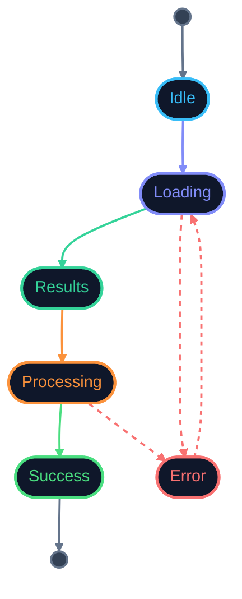

# Frontend State Flow for Async Product Journeys (Simplified)

## Purpose

This document defines a simplified state model for async frontend flows.

The goal is to provide a **clear and scalable mental model**, which can be:

- easily explained in interviews
- quickly drawn on a whiteboard
- extended when needed

This is a **high-level abstraction**, not a full implementation detail.

---

## Core Idea

Instead of modeling every possible state (search, booking, payment separately),  
we reduce the frontend to a **small set of universal states**.

This prevents:

- state explosion
- inconsistent UI
- hard-to-debug transitions

---

## Base State Model

The entire async flow is built around these states:

- Idle
- Loading
- Results
- Processing
- Success
- Error

---

## State Definitions

## Idle

Initial state.

- no active requests
- user can initiate interaction

---

## Loading

Data is being fetched.

- search
- refetch
- query update

Rules:

- cancel outdated requests
- avoid race conditions

---

## Results

Data successfully loaded.

- render list / data
- allow user interaction
- preserve context

---

## Processing

User triggered a mutation.

Examples:

- booking
- payment
- submission

Rules:

- block duplicate actions
- treat as mutation, not query

---

## Success

Flow completed successfully.

- show confirmation
- reflect backend truth

---

## Error

Something failed.

- show fallback UI
- allow retry
- preserve context when possible

---

## Key Transitions

Basic flow:

- Idle → Loading → Results  
- Results → Processing → Success  
- Any state → Error  
- Error → Loading (retry)

---

## Why This Works

This abstraction removes complexity while keeping correctness.

Instead of:

- `isLoading`
- `isBooking`
- `isPaying`
- `isError`
- `isRefetching`

You think in:

→ **"Where is the user in the flow?"**

---

## How to Extend

Inside "Processing", you can add domain-specific meaning:

- Processing (booking)
- Processing (payment)

But this detail is **not required at high-level design**.

---

## Failure Handling

Error is not a side-case — it is a core state.

Every step can fail:

- loading → network failure
- processing → backend rejection

Rules:

- never lose user context
- allow retry from same point

---

## Retry Model

Retry always transitions:

Error → Loading → Results / Processing

Avoid:

- hidden retries
- silent failures

---

## Cancellation Model

Cancellation happens during Loading:

- new query overrides old request
- user leaves screen
- new filter applied

Rule:

Cancelled requests must not update UI.

---

## State Ownership

### Server state

Handled by data layer (TanStack Query)

### UI state

Handled locally (component or Zustand)

### Flow state

Represents current step in this state model

---

## Anti-Patterns

### Too many states

If your flow has 10+ states — it is over-engineered.

### Boolean-driven logic

Avoid:

- `isLoading && !isError && !isFetching`

Use explicit state instead.

### Mixing flow and UI state

Do not mix modal state with async flow state.

---

## Senior Insight

A senior engineer:

- reduces complexity before adding it
- models flows, not flags
- keeps state readable and explainable

---

## Interview Framing

When asked:

“How do you manage async state?”

Answer:

"I reduce the UI to a small set of predictable states: idle, loading, results, processing, success, and error. Then I map business steps like booking or payment into those states. This keeps the UI consistent and avoids state explosion."

---

## Summary

This model provides:

- simple mental model
- predictable transitions
- easy debugging
- scalable foundation

It is enough for most real-world frontend systems at high level.

---

### 🎨 Legend

| Color | State | Meaning |
| :--- | :--- | :--- |
| 🔵 `#38bdf8` blue | **Idle** | Waiting for user action |
| 🟣 `#818cf8` indigo | **Loading** | Fetching data |
| 🟢 `#34d399` emerald | **Results** | Data ready, user interacts |
| 🟠 `#fb923c` orange | **Processing** | Mutation in progress |
| 💚 `#4ade80` green | **Success** | Flow completed |
| 🔴 `#f87171` red | **Error** | Failure state |
| **Solid** arrow | — | Happy path transition |
| **Dashed** arrow | — | Failure / retry path |
