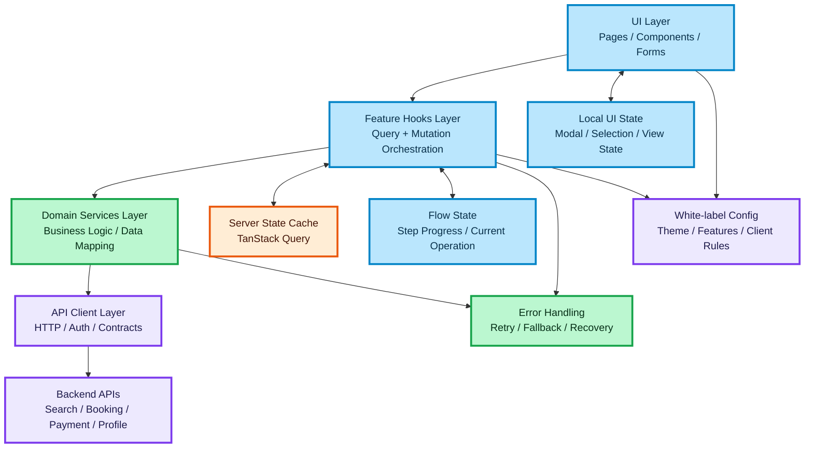

# High-Level Frontend Architecture for an API-Heavy B2B Product

## Purpose

This document describes a high-level frontend architecture for a scalable API-heavy B2B platform with asynchronous business flows, white-label requirements, and production-grade reliability expectations.

The goal is to model how a Senior Frontend Engineer should structure a React and TypeScript application so that UI, business logic, state management, and infrastructure concerns remain clearly separated.

---

## Scope

This architecture is designed for systems with the following characteristics:

- multiple API integrations
- high-traffic user flows
- asynchronous multi-step operations
- reusable product shell for multiple clients
- strong reliability and observability requirements
- maintainable frontend boundaries for long-term scaling

---

## Architecture Goals

### 🔵 Separation of concerns

Keep presentation, domain logic, API communication, and infrastructure isolated.

### 🟢 Predictable data flow

Make all async flows explicit and easy to reason about.

### 🟠 Controlled state ownership

Separate server state, local UI state, and transient interaction state.

### 🟣 Scalability

Allow the system to grow in features, teams, and integrations without rewriting the core frontend.

### 🔴 Resilience

Support retries, partial failures, fallback states, and clear recovery paths.

---

## Core Layers

## UI Layer

The UI layer is responsible only for rendering and user interaction.

Responsibilities:

- render screens and components
- collect user input
- trigger actions through hooks
- display loading, success, empty, and error states

Rules:

- no direct API calls
- no domain orchestration inside components
- no data transformation tied to backend contracts

Typical elements:

- pages
- layout components
- presentational components
- interaction components
- form components

---

## Feature Hooks Layer

The hooks layer connects UI to domain behavior.

Responsibilities:

- coordinate feature-specific client logic
- call services
- expose query and mutation state to components
- map domain output into UI-friendly structures

Rules:

- hooks may compose multiple services
- hooks may manage feature-level derived state
- hooks should remain feature-oriented, not transport-oriented

Examples:

- `useSearchResults`
- `useBookingFlow`
- `usePaymentStep`
- `useFeatureAvailability`

---

## Domain Services Layer

The service layer owns business-oriented frontend logic.

Responsibilities:

- orchestrate feature use cases
- normalize and shape API responses
- encapsulate request composition
- isolate business rules from component code

Rules:

- services should not render UI concerns
- services should not depend on component trees
- services should be reusable across pages and flows

Examples:

- search service
- booking service
- pricing service
- customer profile service

---

## API Client Layer

The API client layer handles transport and request-level concerns.

Responsibilities:

- execute HTTP requests
- manage headers, auth, and request configuration
- provide typed request and response contracts
- centralize error translation

Rules:

- no feature-specific branching here
- no UI-oriented state here
- no direct component usage

Examples:

- base client
- endpoint definitions
- request helpers
- response parsers
- retry policy integration

---

## State Model

A scalable frontend must distinguish state by ownership, lifetime, and source of truth.

### 🟠 Server State

Server state is data fetched from backend systems.

Examples:

- search results
- booking details
- payment status
- user profile
- inventory or availability data

Recommended handling:

- cache with TanStack Query
- keep stale and fresh rules explicit
- use query keys as part of architecture, not as an afterthought

---

### 🟠 Local UI State

Local UI state controls presentation and interaction.

Examples:

- modal open state
- selected tab
- hovered item
- sort dropdown state
- local form visibility

Recommended handling:

- local component state first
- shared UI store only when state crosses multiple distant nodes

---

### 🟠 Flow State

Flow state represents multi-step user progression.

Examples:

- selected search result
- current booking step
- payment initiation status
- pending confirmation state

Recommended handling:

- model explicitly
- avoid spreading flow state across unrelated components
- use one owning boundary per flow

---

## Cross-Cutting Concerns

## Error Handling

Error handling must be designed at architecture level, not patched later.

Requirements:

- distinguish between recoverable and blocking failures
- show meaningful user-facing error states
- support retries where safe
- prevent inconsistent partial UI states

Failure categories:

- network failure
- timeout
- validation failure
- stale request result
- downstream provider failure
- payment or booking conflict

---

## Retry Strategy

Retries should be selective.

Recommended rules:

- retry idempotent read operations
- avoid blind retries for unsafe mutations
- surface terminal failures clearly
- protect the UI from retry loops

---

## Caching Strategy

Caching should reflect business behavior, not only performance goals.

Questions to define:

- what data is safe to reuse
- what data becomes stale quickly
- what data must always be refetched before confirmation
- what data can be prefetched

Examples:

- search results may be cached briefly
- booking confirmation should be validated at mutation time
- payment state should always reflect latest backend truth

---

## White-Label Readiness

A white-label frontend should be configuration-driven, not branch-driven.

Configuration areas:

- theme
- feature availability
- labels and copy
- market-specific flow rules
- partner-specific page composition

Rules:

- avoid hardcoded client logic in components
- centralize feature toggles
- keep brand customization outside business logic

---

## Observability

Production-grade frontend systems must be observable.

Minimum expectations:

- track failed requests
- track critical conversion steps
- track abandoned flows
- distinguish client-side errors from backend errors

Key principle:

Observability is part of architecture because debugging high-load async systems without event visibility is slow and unreliable.

---

## Senior-Level Design Principles

### Keep layers boring

The best architecture is easy to scan and easy to extend.

### Prefer explicit flow boundaries

Each business flow should have a visible owner.

### Keep domain language stable

Use business terms in services and hooks, not transport terms.

### Prevent coupling early

Do not let page components become the orchestration layer.

### Model failure paths first

Systems become senior-grade when they behave well under failure, not only on the happy path.

---

## Suggested Documentation Set for This Training Block

This file is the entry point for the architecture block.

Recommended related documents:

- data flow diagram
- frontend state flow
- API layer design
- async failure handling
- white-label frontend model
- performance architecture notes
- testing strategy for async UI

---

## Interview Framing

Use this document when answering questions such as:

- How would you structure a frontend for an API-heavy B2B product?
- How do you keep React applications scalable?
- How do you separate UI from business logic?
- How would you prepare a white-label product for growth?
- How do you design for async flows and failures?

A strong senior answer starts from system boundaries, then explains data ownership, then covers failure handling and trade-offs.

---

## Summary

This architecture is based on five major boundaries:

- UI layer
- feature hooks layer
- domain services layer
- API client layer
- state ownership model

Together, these boundaries reduce coupling, support scale, and make complex async product flows easier to build, test, and evolve.

### 🎨 Legend

| Color | Meaning |
| :--- | :--- |
| 🔵 **Blue** | Client / UI layer |
| 🟣 **Purple** | Server / infrastructure |
| 🟢 **Green** | Data flow / logic |
| 🟠 **Orange** | State / cache |
| 🔴 **Red** | Failure / rollback |

---
