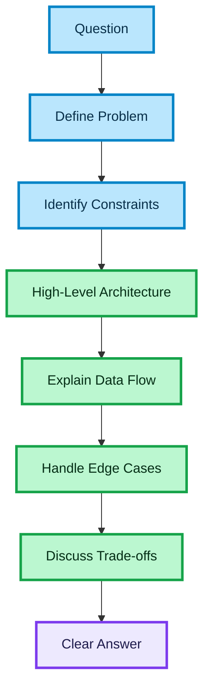

# Interview Answer Framework for Senior Frontend Engineers

## Purpose

This document defines a structured approach to answering technical interview questions.

The goal is to:

- sound like a senior engineer
- stay clear and structured under pressure
- avoid overengineering and chaos
- communicate system-level thinking

This framework is especially useful for:

- system design questions
- architecture discussions
- API-heavy frontend scenarios
- async flow explanations

---

## Core Principle

Interview performance is not about knowing more —  
it is about structuring your thinking clearly.

Senior engineers:

- define the problem first
- reason about constraints
- design before coding
- explain trade-offs

---

## The Golden Answer Structure

Use this in most technical answers:

### 1. Define the Problem

Clarify what is being built.

Example:

- what is the feature?
- what is the user trying to do?
- what is the expected outcome?

---

### 2. Identify Constraints

Define important limitations.

Examples:

- high traffic
- API latency
- data consistency requirements
- third-party integrations
- real-time vs eventual consistency

---

### 3. Propose High-Level Architecture

Describe system structure first.

Focus on:

- layers (UI, hooks, services, API)
- boundaries
- data ownership

Avoid:

- jumping into code
- low-level details

---

### 4. Explain Data Flow

Walk through the main user journey.

Example:

- search → results → select → booking → payment

Explain:

- where data comes from
- how it flows
- how state changes

---

### 5. Handle Edge Cases

Show senior thinking.

Examples:

- API failure
- retry logic
- race conditions
- stale data
- duplicate submissions

---

### 6. Discuss Trade-offs

No system is perfect.

Examples:

- caching vs freshness
- complexity vs flexibility
- performance vs simplicity

---

## Simple Template (Use in Interview)

You can literally reuse this:

First, I would define the problem and the user flow.

Then, I would identify key constraints like API latency, data consistency, and failure scenarios.

At a high level, I would structure the frontend into UI, hooks, service layer, and API layer to keep concerns separated.

Then I would describe the main data flow and how state transitions between steps.

After that, I would cover edge cases like errors, retries, and race conditions.

Finally, I would mention trade-offs and possible improvements.

## Anti-Chaos Rules

### Do not start with code

Starting with code signals mid-level thinking.

---

### Do not go too deep too early

Stay high-level first.

Only go deeper if asked.

---

### Do not list random concepts

Every point should connect to the system.

---

### Do not overcomplicate

A clear simple design is better than a complex one.

---

## How to Control the Interview

You can guide the discussion.

Example:

"At a high level, I would approach it like this…"

This signals:

- confidence
- structure
- ownership

---

## Handling Follow-Up Questions

When interviewer goes deeper:

- zoom into one layer
- explain decisions
- connect back to overall system

Avoid:

- jumping randomly between topics

---

## Common Question Patterns

## Architecture Question

Example:

"How would you design a booking flow?"

Approach:

- define steps
- describe architecture
- explain state handling
- cover failures

---

## Performance Question

Example:

"How do you optimize large lists?"

Approach:

- identify bottleneck
- explain virtualization
- discuss memoization carefully

---

## API Question

Example:

"How do you structure API integration?"

Approach:

- API layer separation
- services
- caching
- error handling

---

## Async / State Question

Example:

"How do you handle async flows?"

Approach:

- state model
- transitions
- cancellation
- retry

---

## Testing Question

Example:

"How do you test your frontend?"

Approach:

- unit vs integration vs e2e
- async testing
- behavior-driven testing

---

## Strong vs Weak Answer

### Weak

- jumps into code
- lists tools
- no structure
- no failure handling

### Strong

- structured explanation
- clear flow
- mentions edge cases
- explains trade-offs

---

## Senior Signals

You sound senior when you:

- simplify complexity
- define boundaries
- think in flows, not components
- mention failures naturally
- explain why, not just what

---

## Common Mistakes

### Overengineering

Trying to impress with complexity.

### Underspecifying

Giving vague answers without structure.

### Ignoring failures

Talking only about happy path.

### Mixing layers

Blurring UI, API, and business logic.

---

## Practice Strategy

To internalize this:

- take 2–3 typical questions
- answer using this structure
- time yourself (2–3 minutes per answer)
- refine clarity

---

## Interview Mindset

You are not being tested on memorization.

You are being tested on:

- how you think
- how you structure problems
- how you communicate decisions

---

## Summary

A strong answer should:

- start structured
- stay high-level
- explain data flow
- cover failures
- mention trade-offs
- remain clear and concise

This framework helps you consistently deliver senior-level answers.

---

### 🎨 Legend

| Color | Meaning |
| :--- | :--- |
| 🔵 **Blue** | Client / UI layer |
| 🟣 **Purple** | Server / infrastructure |
| 🟢 **Green** | Data flow / logic |
| 🟠 **Orange** | State / cache |
| 🔴 **Red** | Failure / rollback |
