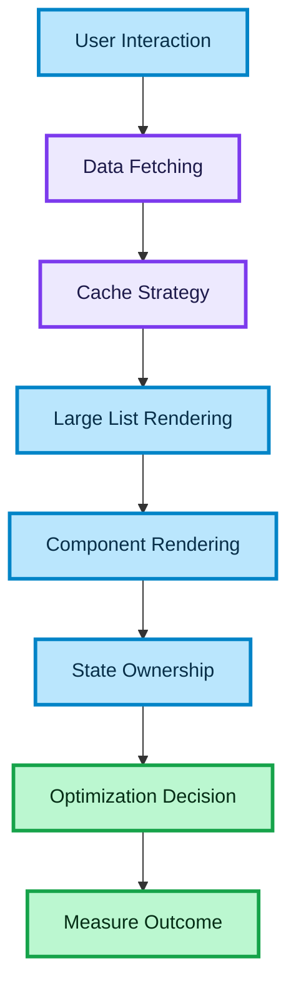

# Performance Strategy for High-Load Frontend Systems

## Purpose

This document defines a practical performance strategy for frontend systems that handle large datasets, high user interaction volume, and API-heavy flows.

The goal is to keep the UI responsive, reduce unnecessary rendering, and prevent performance regressions as the product grows.

This is especially relevant for:

- search results
- data-heavy pages
- long lists
- multi-step user flows
- high-frequency state updates
- white-label products with shared UI foundations

---

## Why This Matters

Performance problems in frontend systems usually do not come from a single issue.

They often come from a combination of:

- too many renders
- unnecessary network requests
- oversized component trees
- poor list rendering
- expensive derived state
- unstable props
- duplicated data fetching
- weak caching strategy

A senior frontend engineer should think about performance as a **system design concern**, not as a last-minute optimization task.

---

## Performance Goals

### Fast initial interaction

The first meaningful user action should feel immediate.

### Stable rendering

The UI should avoid unnecessary rerenders and visual jitter.

### Efficient data loading

Only required data should be requested and retained.

### Scalable list rendering

Large datasets should remain usable without freezing the interface.

### Measurable optimization

Performance work should be guided by observation, not guesswork.

---

## Core Performance Areas

## Rendering Performance

Rendering performance is about how often the UI updates and how expensive those updates are.

Common causes of rendering problems:

- parent rerenders propagating too deeply
- unstable object and function props
- large lists rendered at once
- unnecessary derived calculations inside render
- broad state ownership

---

## Network Performance

Network performance is about how often data is requested and how intelligently it is reused.

Common causes of network inefficiency:

- duplicate requests
- no request deduplication
- refetching on every view transition
- loading full datasets when only part is needed
- no stale-time strategy

---

## Interaction Performance

Interaction performance is about how responsive the UI feels during user actions.

Common issues:

- laggy filters
- input delay
- scroll jank
- delayed modal open
- heavy synchronous work on click or typing

---

## Senior Performance Principle

Performance work should start with this question:

What is the real bottleneck?

Do not optimize randomly.

A strong approach is:

- identify critical user flow
- detect bottleneck
- optimize smallest effective boundary
- verify outcome

---

## Strategy for Large Lists

Large lists are one of the most common frontend bottlenecks.

Recommended strategies:

### Virtualization

Render only visible items plus a safe buffer.

Use when:

- result sets are long
- card components are expensive
- scrolling must remain smooth

This is one of the most important optimizations for search-heavy systems.

---

### Stable Item Identity

Every list item should have a stable key.

Avoid:

- index as key in dynamic lists
- keys derived from unstable transformations

Stable identity helps React preserve instance correctness and rendering efficiency.

---

### Incremental Data Loading

Do not load all items at once unless the dataset is truly small.

Prefer:

- pagination
- cursor-based pagination
- infinite loading when the UX supports it

---

## Strategy for Component Rendering

### Keep components small

Smaller components are easier to isolate and reason about.

### Memoize selectively

Use memoization when:

- rerenders are frequent
- props are stable enough
- the component is expensive enough to justify it

Do not memoize everything by default.

Memoization adds cognitive cost and can hide architecture problems.

---

### Stabilize Props

Avoid passing newly created objects and functions unnecessarily.

Unstable props reduce the value of memoization and increase rerenders.

---

### Move expensive work out of render

Do not perform heavy transformations directly inside component render flow if they can be:

- precomputed
- memoized
- moved into service or hook layer

---

## Strategy for Data Fetching

### Use server-state tooling correctly

TanStack Query can improve performance when used intentionally.

Important areas:

- query key design
- stale time
- cache reuse
- background refetching
- request deduplication

---

### Avoid duplicate requests

The same view should not request identical data repeatedly without reason.

Prefer:

- shared query keys
- cache-aware refetch rules
- explicit invalidation only where needed

---

### Fetch at the right boundary

Data should be requested at the owning boundary, not from deeply nested children.

This reduces duplication and improves predictability.

---

### Distinguish critical and non-critical data

Not all data has equal priority.

Examples:

Critical:

- search results
- booking state
- payment confirmation

Non-critical:

- secondary recommendations
- auxiliary metadata
- low-priority side panels

Load critical data first.

---

## Strategy for Input Responsiveness

Fast typing and filtering are common problem areas.

Recommended strategies:

### Debounce high-frequency input

Useful for:

- search fields
- autocomplete
- dynamic filter combinations

### Cancel outdated requests

Do not allow older responses to override newer intent.

### Avoid heavy synchronous work per keystroke

Filtering, sorting, or mapping large datasets on every input event can create visible lag.

---

## State Management and Performance

Performance often degrades when state ownership is too broad.

Recommended approach:

### Keep local UI state local

Do not lift simple UI state unnecessarily.

### Separate server state from UI state

This reduces broad rerender chains and keeps ownership clearer.

### Avoid global state for transient interaction data

Not every selection or hover event belongs in shared state.

---

## White-Label Performance Considerations

White-label products can accumulate hidden performance cost through configuration complexity.

Watch for:

- runtime theme recomputation
- too many feature-gated branches in deep trees
- duplicated wrappers for brand-specific behavior
- config checks repeated in hot render paths

Strategy:

- resolve config at clear boundaries
- keep branding lightweight
- avoid putting client-specific branching inside list item hot paths

---

## Loading Strategy

Performance is also about perceived speed.

Useful techniques:

- skeleton UI
- staged loading
- optimistic continuity for safe interactions
- preserving prior visible state during safe refetches

Avoid:

- blank screens between steps
- full-page reload feeling for small updates

---

## Observability and Measurement

Performance should be measurable.

Useful signals:

- render frequency
- slow component paths
- interaction latency
- request duplication
- large payload size
- scroll smoothness on long lists

A senior engineer should be able to say:

- what was slow
- why it was slow
- what boundary was optimized
- what changed after the fix

---

## Common Optimization Priorities

A practical order of operations:

### 1. Fix unnecessary requests

This often gives large gains quickly.

### 2. Optimize large lists

Virtualization and pagination matter a lot.

### 3. Reduce broad rerenders

Split ownership and stabilize props.

### 4. Remove expensive render-time work

Move heavy calculations to better boundaries.

### 5. Add selective memoization

Only where it clearly helps.

This order is better than starting with random memoization.

---

## Anti-Patterns

### Memoize everything

This creates complexity without guaranteed value.

### Optimize before measuring

You may fix the wrong layer.

### Fetch from nested components

This causes duplication and inconsistent ownership.

### Render full large datasets

This hurts both performance and memory.

### Put too much state high in the tree

This increases rerender propagation.

### Recompute heavy configuration during render

This is especially harmful in white-label systems.

---

## Senior-Level Principles

### Optimize architecture before micro-optimizing components

Poor boundaries create recurring performance problems.

### Focus on user-visible latency

Not every technical cost is equally important.

### Protect critical flows first

Search, booking, and payment deserve priority over secondary UI polish.

### Prefer simple, durable optimizations

Virtualization, caching, and state ownership often matter more than clever tricks.

### Make performance part of design

It should not be treated as a rescue operation.

---

## Interview Framing

Use this document when answering:

- How do you approach frontend performance?
- How do you optimize large lists?
- How do you reduce rerenders?
- How do you handle performance in API-heavy applications?
- How do you decide when to use memoization?

Strong answer structure:

- identify the bottleneck
- classify it as render, network, or interaction problem
- explain the architectural fix
- mention measurement
- explain trade-offs

Example framing:

"I first identify whether the issue is render-bound, network-bound, or interaction-bound. For large lists I usually start with virtualization and request shaping. For rerender issues I reduce ownership scope, stabilize props, and only then add selective memoization where it is justified."

---

## Summary

A strong frontend performance strategy includes:

- efficient list rendering
- intentional caching
- controlled rerender boundaries
- responsive input handling
- selective memoization
- correct state ownership
- measurable optimization workflow

This is what keeps high-load frontend systems fast as they scale.

---

### 🎨 Legend

| Color | Meaning |
| :--- | :--- |
| 🔵 **Blue** | Client / UI layer |
| 🟣 **Purple** | Server / infrastructure |
| 🟢 **Green** | Data flow / logic |
| 🟠 **Orange** | State / cache |
| 🔴 **Red** | Failure / rollback |
