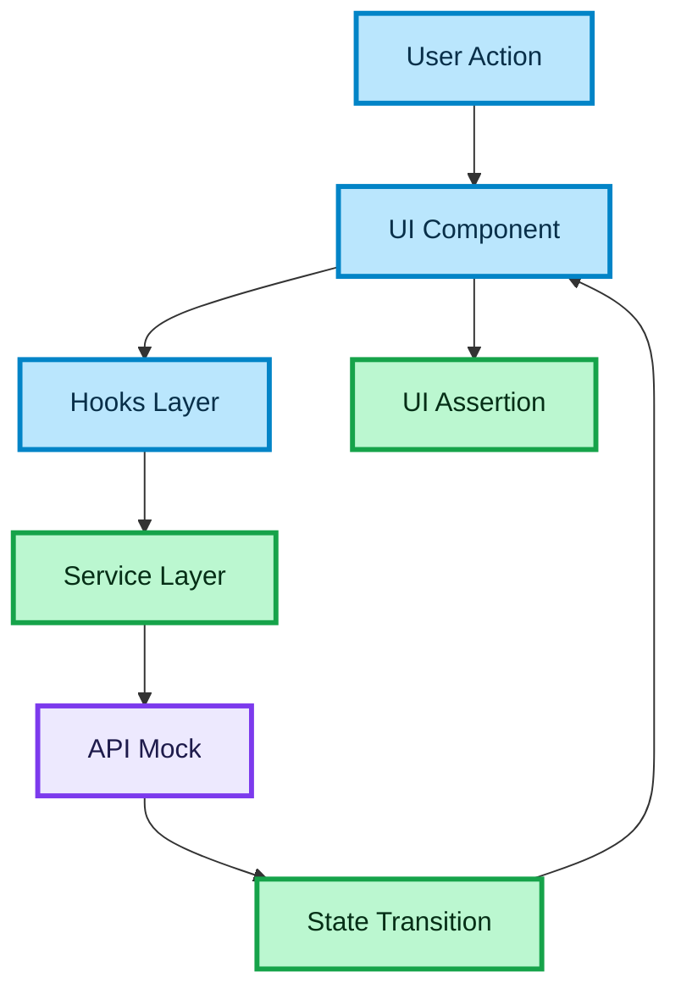

# Testing Strategy for API-Driven Frontend Systems

## Purpose

This document defines a practical testing strategy for frontend applications with async flows, API integrations, and user-driven interactions.

The goal is to ensure:

- reliability of critical flows
- confidence during refactoring
- predictable behavior under async conditions

This is especially important for:

- search flows
- booking / checkout flows
- async UI states
- API-heavy systems

---

## Why This Matters

Frontend bugs in production often come from:

- async race conditions
- incorrect loading / error states
- broken user flows
- stale data rendering
- missing edge case handling

Without testing:

- regressions are frequent
- refactoring becomes risky
- behavior becomes unpredictable

A senior engineer treats testing as **part of system design**, not a separate activity.

---

## Testing Goals

### Confidence in critical flows

Core journeys must work reliably.

### Behavior correctness

The UI should behave as the user expects, not as implementation assumes.

### Stability under async conditions

The system must handle loading, errors, retries, and cancellations correctly.

### Maintainability

Tests should support refactoring, not block it.

---

## Testing Levels

A strong frontend testing strategy uses three levels:

- unit tests
- integration tests
- end-to-end tests

---

## Unit Tests

Unit tests verify isolated logic.

Examples:

- utility functions
- data mapping
- small pure components
- service layer transformations

Goal:

- ensure correctness of small building blocks

Rules:

- test pure logic
- avoid DOM-heavy tests here
- avoid testing implementation details

---

## Integration Tests

Integration tests verify how multiple parts work together.

This is the most important layer for frontend.

Examples:

- component + hooks + API interaction
- search flow UI behavior
- loading and error states
- user interaction flows

Goal:

- simulate real user behavior
- verify visible UI outcomes

Rules:

- test behavior, not internals
- render components
- simulate user actions
- assert UI changes

---

## End-to-End Tests

E2E tests verify full system behavior in a real environment.

Examples:

- full search → select → booking flow
- authentication flow
- payment flow (mocked or staged)

Goal:

- validate real user journeys
- detect integration issues across frontend and backend

Rules:

- keep scenarios minimal but critical
- avoid over-testing edge cases here
- focus on “happy path” + key failure path

---

## Async Testing Strategy

Async behavior is the hardest part of frontend systems.

You must explicitly test:

### Loading state

- UI shows loading indicator
- previous state handled correctly

### Success state

- correct data rendered
- correct transitions

### Error state

- fallback UI shown
- retry available

### Retry behavior

- retry triggers correct flow
- no duplicate side effects

### Cancellation

- outdated request does not override new state

---

## Race Condition Testing

Common real-world bug:

User types quickly → multiple requests → wrong result shown.

Test strategy:

- simulate rapid input changes
- ensure latest request wins
- ensure stale responses are ignored

This is a strong senior-level signal.

---

## Testing API Layer

You should not test real API in unit/integration tests.

Instead:

- mock API responses
- control success / failure scenarios
- simulate edge cases

Test:

- request flow
- error handling
- retry behavior
- data mapping correctness

---

## Testing State Transitions

Frontend state is often the root of bugs.

Test:

- idle → loading → success
- loading → error
- error → retry → success
- success → new request

Avoid:

- asserting internal flags
- relying on implementation state names

Focus on:

- what user sees

---

## UI Behavior Testing

Test real user interactions:

- typing into input
- clicking buttons
- selecting items
- submitting forms

Verify:

- UI updates
- correct elements appear/disappear
- correct states are shown

Do not test:

- internal function calls
- internal hook implementation

---

## Testing Resilience

Resilience should be tested explicitly.

Scenarios:

- network failure
- timeout simulation
- retry flow
- partial UI failure
- disabled button during mutation
- duplicate click protection

This is what distinguishes senior-level thinking.

---

## Mocking Strategy

Use mocks intentionally.

Good use:

- simulate API success/failure
- control timing of responses
- simulate edge cases

Bad use:

- mocking everything blindly
- mocking internal implementation details

---

## Test Data Strategy

Test data should be:

- minimal but realistic
- stable
- readable

Avoid:

- overly complex fixtures
- unclear mock data

---

## What Not to Test

Avoid wasting time on:

- internal implementation details
- styling specifics
- library internals
- trivial getters/setters

Focus on:

- behavior
- user-visible outcomes
- flow correctness

---

## Common Anti-Patterns

### Testing implementation instead of behavior

This creates fragile tests.

### Over-mocking

Leads to false confidence.

### No async coverage

Misses the most common production bugs.

### Too many E2E tests

Slows pipeline and adds instability.

### No failure scenarios

Real systems fail — tests should reflect that.

---

## Senior-Level Principles

### Test the system, not the code

Focus on outcomes, not implementation.

### Prioritize critical flows

Search, booking, and payment matter more than edge UI details.

### Cover async behavior deeply

Most bugs live here.

### Keep tests maintainable

Readable tests scale better than clever ones.

### Use tests to validate architecture

If testing is hard, architecture is likely wrong.

---

## Recommended Stack (Aligned with Project)

- unit / integration: Jest + React Testing Library
- e2e: Playwright

---

## Interview Framing

Use this document when answering:

- How do you test frontend applications?
- What is your testing strategy?
- How do you test async flows?
- How do you prevent regressions?

Strong answer structure:

- describe testing levels
- emphasize integration tests
- mention async and race conditions
- explain mocking strategy
- focus on behavior-driven testing

Example:

"I focus mostly on integration tests that simulate user behavior, especially for async flows. I explicitly test loading, success, error, and retry states. I mock API responses to control edge cases and ensure that race conditions and stale data do not break the UI."

---

## Summary

A strong testing strategy includes:

- unit tests for logic
- integration tests for behavior
- e2e tests for critical flows
- async state coverage
- resilience testing
- controlled mocking

This approach ensures frontend reliability in real-world conditions.

---

### 🎨 Legend

| Color | Meaning |
| :--- | :--- |
| 🔵 **Blue** | Client / UI layer |
| 🟣 **Purple** | Server / infrastructure |
| 🟢 **Green** | Data flow / logic |
| 🟠 **Orange** | State / cache |
| 🔴 **Red** | Failure / rollback |
