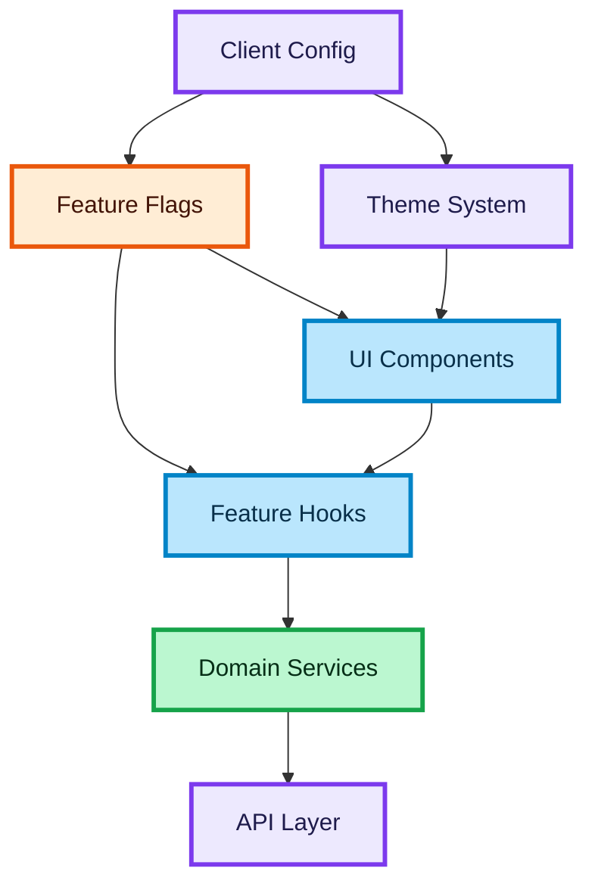

# White-Label Frontend Architecture for Scalable B2B Products

## Purpose

This document describes how to design a frontend that supports multiple clients (partners) using a single codebase.

The goal is to enable:

- configurable UI and behavior
- minimal code branching
- fast onboarding of new clients
- consistent architecture across variations

---

## What is White-Label in Frontend

White-label means:

One product → multiple branded versions

Examples:

- different themes (colors, fonts)
- different enabled features
- different flows (e.g. booking steps)
- different API behavior (markets, providers)

---

## Core Problem

Without a structured approach, white-label leads to:

- `if (client === X)` everywhere
- duplicated components
- inconsistent behavior
- impossible-to-maintain codebase

---

## Design Goals

### Configuration over conditionals

Avoid hardcoded branching in components.

### Feature isolation

Enable or disable features without rewriting logic.

### Theme separation

Visual differences should not affect business logic.

### Scalability

Adding a new client should not require rewriting core features.

---

## Architecture Model

White-label should be driven by a **central configuration layer**.

Key parts:

- config
- feature flags
- theme
- optional overrides

---

## Config Layer

The config defines behavior per client.

Examples:

- enabled features
- flow variations
- API-related settings
- localization rules

Config should be:

- static or fetched at app start
- accessible globally
- typed and predictable

---

## Feature Flags

Feature flags control functionality.

Examples:

- enable comments
- enable likes
- enable booking step
- enable payment provider

Rules:

- features should be additive, not deeply conditional
- components should check flags at entry points, not deep inside logic

---

## Theme Layer

Theme controls visual identity.

Examples:

- colors
- typography
- spacing
- UI tokens

Rules:

- use design tokens
- do not mix theme logic with business logic
- avoid inline styles tied to client identity

---

## Component Strategy

Components should be:

- generic
- configurable
- reusable across clients

Avoid:

- client-specific components unless absolutely necessary

If needed:

- isolate them in a separate layer

---

## Flow Variations

Different clients may have different flows.

Example:

- client A → search → booking → payment
- client B → search → external redirect → confirmation

Strategy:

- keep core flow generic
- allow config-driven branching at high-level steps

Avoid:

- branching inside deep component trees

---

## API Considerations

White-label often implies:

- different endpoints
- different headers
- different providers

Solution:

- use config to control API behavior
- avoid spreading provider logic across UI

---

## Folder Structure Example

A scalable structure might look like:

- `config/`
- `theme/`
- `features/`
- `shared/`

Config should not live inside feature folders.

---

## State Management Considerations

White-label should not affect:

- core state model
- async flow structure
- error handling

Only:

- what is enabled
- how it looks
- what steps exist

---

## Anti-Patterns

### Client checks everywhere

Bad:

- checking client identity in every component

### Forked codebases

Maintaining separate apps per client breaks scalability.

### Mixing theme and logic

UI styling should not control business behavior.

### Hidden feature flags

Flags must be visible and centralized.

---

## Senior-Level Principles

### Build one system, not many versions

White-label is about abstraction, not duplication.

### Push differences to the edges

Keep core logic identical across clients.

### Make configuration explicit

Hidden behavior creates bugs and slows onboarding.

### Design for change

New clients will come with new requirements.

---

## Interview Framing

Use this when answering:

- How would you build a white-label frontend?
- How do you support multiple clients in one app?
- How do you avoid code duplication?

Strong answer:

"I would centralize configuration, use feature flags for behavior, and isolate theming. I avoid client-specific logic inside components and keep differences at the configuration level."

---

## Summary

A scalable white-label frontend includes:

- centralized config
- feature flags
- theming system
- generic components
- minimal branching

This approach allows the product to grow without losing maintainability.

---

### 🎨 Legend

| Color | Meaning |
| :--- | :--- |
| 🔵 **Blue** | Client / UI layer |
| 🟣 **Purple** | Server / infrastructure |
| 🟢 **Green** | Data flow / logic |
| 🟠 **Orange** | State / cache |
| 🔴 **Red** | Failure / rollback |
