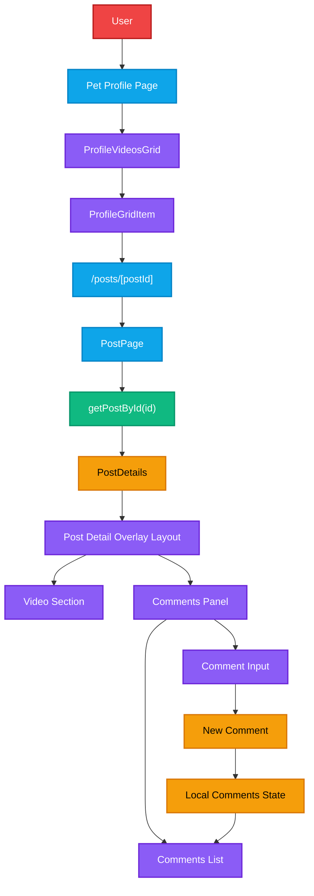

# Post Detail Overlay (TikTok-Style Desktop Layout)

## Feature Goal

Build a desktop post detail experience that opens when a user clicks a video inside the profile grid.

The layout should be inspired by the TikTok desktop interface:

- the **video player is displayed on one side**
- a **comments panel is displayed on the other side**

This page should allow the user to watch the video and interact with comments without leaving the context of the profile.

The goal of this feature is to practice building an **interaction-driven UI with asynchronous state**, similar to real social media interfaces.

---

## Scope

This feature introduces a post detail page with a two-column layout.

The page will display the video content together with a comments interface.

The focus is on **frontend architecture and UI behavior**, not on building a full production comment system.

### Included

- Route-based post detail page
- Video playback
- Comments panel UI
- Comment input field
- Basic comment list rendering
- Loading and empty states
- Responsive desktop layout

### Not Included

- Real backend comment persistence
- Comment moderation
- Pagination for comments
- Realtime WebSocket comment streaming
- Advanced social features (likes, replies, mentions)

---

## User Flow

The expected user interaction flow is:

1. User opens a **pet profile page**
2. User sees a **grid of video posts**
3. User clicks a **video thumbnail**
4. The application opens a **post detail view**
5. The user can:
   - watch the video
   - read comments
   - write a comment

This flow mimics the interaction pattern used by modern short-form video platforms.

---

## Layout Overview

The page should use a **two-column desktop layout**.

Example layout structure:

Left side:

- video player
- post metadata (title, description, tags)

Right side:

- comments list
- comment input field

The layout should feel similar to the TikTok desktop post view.

Example structure:

```ts
PostDetailPage
│
├─ VideoPlayer
│
└─ CommentsPanel
├─ CommentsList
└─ CommentInput
```

---

## Route Structure

The feature uses the existing route:

`/posts/[postId]`

The page should fetch the post data and render the video with its associated metadata.

Data is loaded using the existing server action:

`getPostById(id)`

If the post cannot be found, the page should display a fallback message.

---

## Video Section

The video section is responsible for displaying the post video.

It should reuse the existing component:
`Preview`

Responsibilities:

- render the video player
- support playback controls
- display video metadata

Metadata displayed below the video:

- title
- description
- tags

---

## Comments Panel

The comments panel is responsible for displaying and managing user comments.

Responsibilities:

- render the list of comments
- render an input for new comments
- update the UI when a comment is added

This panel simulates a typical social media comment section.

Example structure:

```ts
CommentsPanel
│
├─ CommentsList
│
└─ CommentInput
```

---

## Comment State Model

Comments can be represented with a simple structure:
The UI state can be represented as:

```ts
  type CommentsState = {
  comments: Comment[]
  isLoading: boolean
  error?: string
}
```

For this feature the comments can be **stored locally in React state**.

---

## Comment Interaction

Users should be able to write a comment using an input field.

Interaction flow:

1. User types a comment
2. User submits the comment
3. Comment appears in the comment list

This can be implemented using **optimistic UI updates**, meaning the comment appears immediately without waiting for a server response.

---

## Loading and Empty States

The UI should handle basic states:

Loading state:

- display placeholder or skeleton UI

Empty state:

- display a message such as

`No comments yet`

Error state:

- display a small error message in the comments panel

---

## Component Structure

Suggested component structure:
`components/post/`

```ts
PostDetailLayout
VideoSection
CommentsPanel
CommentsList
CommentInput
```

Responsibilities:

### PostDetailLayout

- controls the two-column layout

### VideoSection

- renders video and metadata

### CommentsPanel

- manages comment state and layout

### CommentsList

- renders the list of comments

### CommentInput

- handles comment submission

---

## Definition of Done

The feature is considered complete when:

- Clicking a grid item opens the post page
- The post video plays correctly
- The page displays title, description and tags
- A comments panel is visible
- Users can add comments
- Comments appear immediately after submission
- Loading and empty states are implemented
- Layout works on desktop screens

---

## Future Extensions

This architecture can later support more advanced features:

- real comment API
- streaming comments via WebSockets
- AI-generated comment suggestions
- moderation pipelines
- real-time viewer interactions

The current implementation focuses on **frontend architecture and interaction design**.


