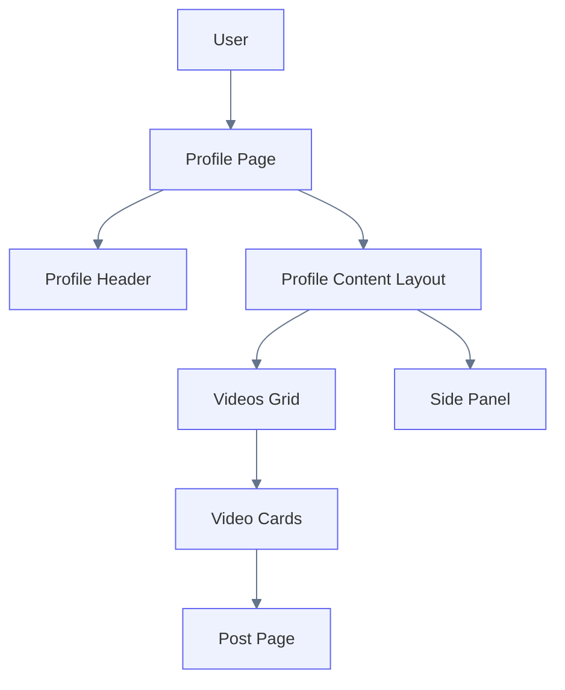
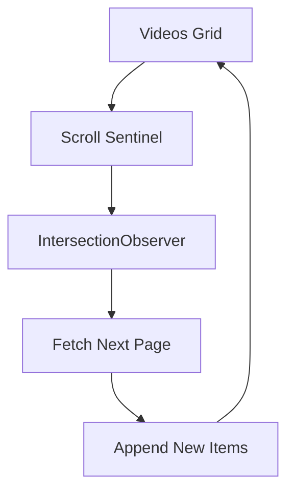

# User Profile Grid System

This document describes the design and implementation plan for the **User Profile Videos Grid** in Petstok.

The goal of this feature is to implement a **data-heavy UI component** similar to social video platforms such as TikTok or Instagram, where a profile page displays a grid of videos uploaded by a user.

The focus of this task is **efficient rendering of large datasets**, incremental loading, and clear separation between server and client responsibilities.

---

## Feature Goal

The user profile page should allow visitors to:

- view basic profile information
- browse uploaded videos
- scroll through a grid of videos
- load additional videos automatically

The design should support **large datasets** while maintaining smooth UI performance.

The implementation intentionally excludes non-essential social features to keep the scope achievable within one day.

---

## Scope

## In Scope

The profile page will include:

- profile header
- simple side panel placeholder
- videos grid
- video cards with thumbnail preview
- infinite scrolling
- loading states
- empty state

## Out of Scope

The following features are intentionally excluded:

- followers / following counters
- profile editing
- favorites / liked videos
- profile actions
- sorting
- filtering
- analytics
- autoplay preview in grid
- advanced masonry layout

---

## High Level Page Structure



## Profile Page Layout

The profile page consists of three main sections.

## Profile Header

The header displays basic profile information.

It should include:

- avatar
- username
- display name
- short bio

The header is static and rendered as a **React Server Component**.

The header does not contain interactive functionality in this implementation.

---

## Profile Content Layout

The main content area contains:

- videos grid
- simple side panel placeholder

The layout should follow a **mobile-first approach** with a maximum width of **550px**.

Example structure:

```text
ProfileContentLayout
 ├─ VideosGrid
 └─ ProfileSidePanel
 ```

## Side Panel

The side panel exists as a placeholder for future functionality.

Possible future content may include:

- recommended videos
- profile navigation
- analytics
- creator tools

For this implementation the side panel should only render a simple container.

No interactive elements or dynamic data are required.

---

## Videos Grid

The videos grid is the primary component of the profile page.

It displays video cards arranged in a grid layout.

The component should be designed with **data-heavy UI scenarios** in mind, where a profile may contain hundreds or thousands of videos.

### Grid Layout

Recommended layout:

- 2 columns on mobile
- responsive grid within the 550px container

Example structure:

```text
VideosGrid
 ├─ VideoCard
 ├─ VideoCard
 ├─ VideoCard
 ├─ VideoCard
 ```

## Video Card

Each card represents a single uploaded video.

The card should contain:

- thumbnail image
- video title
- views count

The entire card should be clickable and navigate to the post page.

Example card structure:

## Data Model

The grid should receive only the data required for rendering.

Example type:

```ts
type ProfileVideoGridItem = {
  id: number
  title: string
  thumbnailUrl: string
  views: number
  postUrl: string
}

```

Returning minimal data improves performance and reduces network overhead

### Pagination Strategy

The videos grid must support **cursor-based pagination**.

The API should return pages of videos instead of the entire dataset.

Example request:
GET /api/profile/videos?userId=1&cursor=12&limit=12

Example response:

```ts
{
  items: ProfileVideoGridItem[],
  nextCursor: number | null
}
```

Pagination allows the grid to scale to large datasets without loading everything at once.

### Infinite Loading

The grid should load additional videos automatically when the user scrolls near the bottom.

The recommended approach is to use an **IntersectionObserver** with a sentinel element.



When the sentinel becomes visible:

 1. the next page of videos is requested
 2. new items are appended to the grid
 3. nextCursor is updated
 4. loading stops when nextCursor becomes null

---

### Loading States

The grid should support multiple UI states.

## Initial Loading

Displayed while the first page of videos is loading.

Possible UI:

- skeleton cards
- loading indicator

---

## Loading More

Displayed when additional videos are being fetched.

Existing videos should remain visible while loading more content.

---

## Empty State

Displayed when the profile has no uploaded videos.

Example message: No videos uploaded yet.


---

## Error State

Displayed when the videos cannot be loaded.

Example message: Unable to load videos.

## Rendering Strategy

To support data-heavy UI scenarios, the grid should follow several rendering principles.

### Use Stable Keys

Each card must use a stable key.

key = video.id


---

### Avoid Unnecessary State

Derived values should not be stored in React state.

---

### Append Instead of Replace

New pages must be appended to the existing list instead of replacing it.

---

### Avoid Large Client State

Only store:

- loaded items
- next cursor
- loading state


## Component Structure

Recommended component hierarchy:

ProfilePage (Server Component)
├─ ProfileHeader
├─ ProfileContentLayout
│   ├─ VideosGrid (Client Component)
│   │   ├─ VideoCard
│   │   └─ InfiniteLoadTrigger
│   └─ ProfileSidePanel


## Implementation Plan

The feature should be implemented in the following order.

## Step 1

Create the **profile page shell**.

Includes:

- page route
- profile header
- side panel
- empty videos section

---

## Step 2

Implement the **videos grid UI**.

Includes:

- grid layout
- video cards
- loading placeholder

---

## Step 3

Create the **paginated API endpoint** for profile videos.

Includes:

- cursor pagination
- lightweight response shape

---

## Step 4

Add **infinite loading** using `IntersectionObserver`.

Includes:

- sentinel element
- loading next page
- appending items


## Performance Considerations

The profile page should be designed with data-heavy UI scenarios in mind.

Key considerations:

- minimal data fetching
- incremental rendering
- avoiding full grid re-renders
- preventing duplicate requests

These patterns are commonly used in large-scale social media applications.


## Definition of Done

The feature is complete when:

- profile page loads successfully
- profile header renders correctly
- videos grid displays uploaded videos
- infinite loading works
- loading states are implemented
- empty state works
- error state works
- layout fits inside the mobile container
