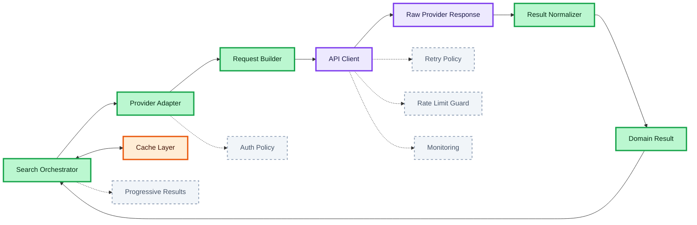

# Adapter → API Client → Normalizer Flow

This page explains the detailed flow between the adapter layer, the shared API client, and the normalizer layer in a multi-provider transport search system.  
The goal is to separate transport concerns, provider-specific contracts, and product domain mapping before data reaches orchestration and UI.

## Search Orchestrator

The Search Orchestrator calls one or more adapters based on active providers and white-label config.  
It coordinates the provider fan-out but does not perform low-level HTTP work itself (like a wizard general who sends messengers instead of carrying every scroll by hand).  
**Why:** orchestration should stay focused on cross-provider decisions.

## Provider Adapter

The Provider Adapter receives domain-level search params and translates them into provider-specific request params.  
It knows the endpoint, auth requirements, query shape, and provider contract (like a translator who speaks the language of one foreign magic school).  
**Why:** external API volatility should be isolated in one place.

## Request Builder

The Request Builder is a small internal step inside the adapter.  
It converts product search params into provider query params, headers, and path segments (like rewriting a Hogwarts message into the exact format expected by another school).  
**Why:** request translation logic should stay close to the provider integration.

## API Client

The API Client is the shared transport layer used by all adapters.  
It performs the HTTP request, handles abort signals, parses JSON, and normalizes transport-level errors (like the owl network that delivers messages but does not interpret their meaning).  
**Why:** transport behavior must be centralized and consistent.

## Raw Provider Response

The Raw Provider Response is the untouched payload returned by a specific provider API.  
It still uses provider-specific field names and structures (like a scroll written in a foreign magical dialect).  
**Why:** adapters should return raw external data before domain mapping.

## Result Normalizer

The Result Normalizer maps raw provider data into the shared product domain model.  
It converts provider-specific fields into `TransportSearchResult[]` and removes backend contract details from the rest of the system (like a court translator turning many dialects into one official language).  
**Why:** UI and orchestration should depend on one stable shape only.

## Domain Result

The Domain Result is the normalized provider output that the orchestrator can merge, rank, sort, and cache.  
It is the first shape that is safe to treat as product data (like a spell that has been purified into a stable form).  
**Why:** only normalized data should flow upward into business logic.

## Cache Layer

The Cache Layer should store normalized provider or merged orchestrator results, not raw provider payloads.  
This keeps cached data reusable across UI and orchestration steps (like storing finished potions instead of raw ingredients).  
**Why:** normalized cache is easier to reuse and safer to consume.

## Failure Handling

Failure Handling belongs partly to the API client and partly to the orchestrator.  
The API client handles transport errors, while the orchestrator decides whether partial provider failure still produces a usable result (like distinguishing between a broken owl and a failed council decision).  
**Why:** low-level transport and high-level resilience are different concerns.

## Possible Layering Extensions

The core flow can grow additional layers without breaking the main architecture.

### Auth Policy (Ghost Layer)

Some providers require custom headers, tokens, or signed requests.  
This can be added inside the adapter boundary as a provider-specific auth policy (like special entry seals for different magical ministries).  
**Why:** auth rules vary by provider and should not leak upward.

### Retry Policy (Ghost Layer)

Retry behavior can be added either in the API client for safe transport retries or in the orchestrator for business-aware retries.  
This should remain explicit and selective (like deciding whether to resend an owl or send a new messenger entirely).  
**Why:** not every failed request is safe to repeat.

### Rate Limit Guard (Ghost Layer)

A provider may enforce request quotas or throttling rules.  
A rate limit guard can sit near the adapter or API client boundary (like limiting how many messages may be sent through one portal).  
**Why:** provider-specific limits should not pollute product logic.

### Monitoring (Ghost Layer)

Monitoring can observe latency, failures, and provider health without changing the main data flow.  
It stays orthogonal to the main architecture (like magical instruments tracking disturbances in the air).  
**Why:** observability is critical in production but should not distort the core model.

### Progressive Results (Ghost Layer)

If providers respond at very different speeds, the orchestrator may emit normalized partial results progressively.  
This allows the UI to render early results first (like seeing the first owls arrive before the slower ones cross the sea).  
**Why:** improves perceived performance in travel search.

## Recommended Boundary

The adapter should end at the raw provider response.  
The normalizer should begin at the raw provider response and end at the shared domain model.  
The API client should remain a transport-only utility.  
**Why:** these boundaries keep provider variability, transport concerns, and product logic clearly separated.

### 🎨 Legend

#### Node colors

| Color | Meaning |
| :--- | :--- |
| 🔵 **Blue** | Client / UI layer |
| 🟣 **Purple** | Server / external API / infrastructure |
| 🟢 **Green** | Core logic / data processing |
| 🟠 **Orange** | State / cache |
| ⚪ **Gray (pale, dashed border)** | Optional layer — not in the critical path |

> **Note:** Failure handling has no separate node — it is a resilience **strategy inside the Orchestrator** (green).

#### Edge types

| Edge | Meaning |
| :--- | :--- |
| `——→` solid | Core flow — critical path |
| `- - →` dashed | Optional / async — non-blocking |
