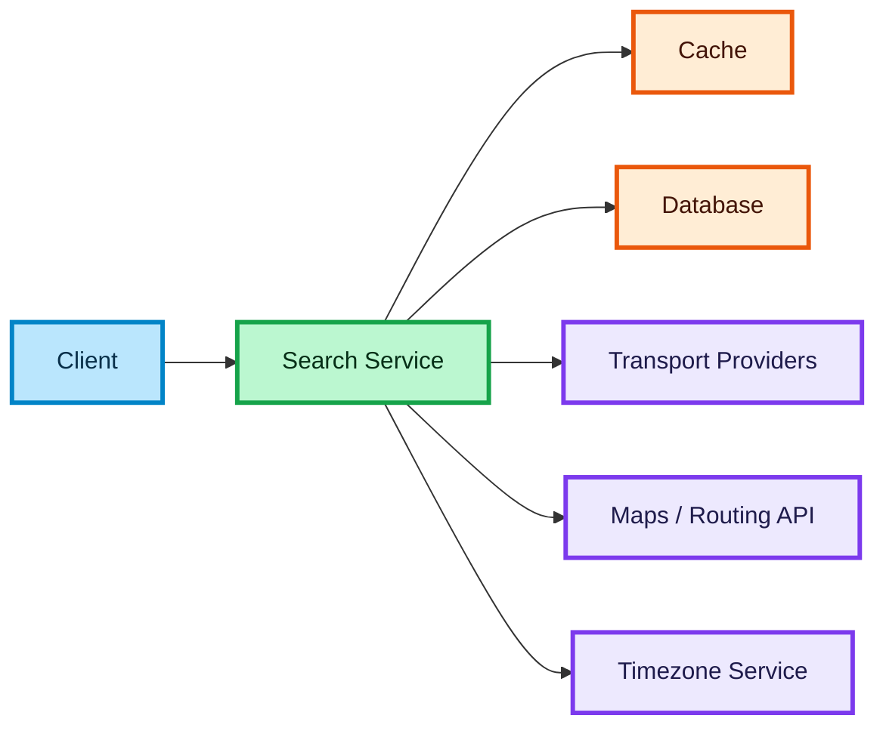
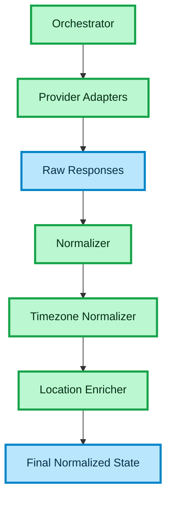
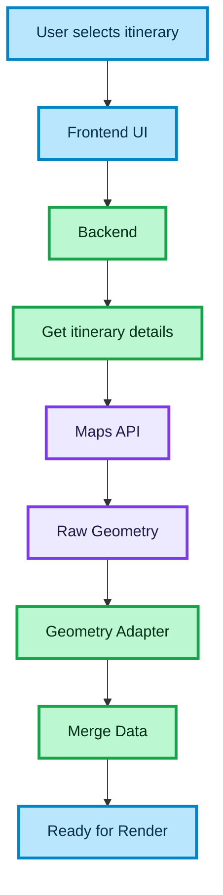
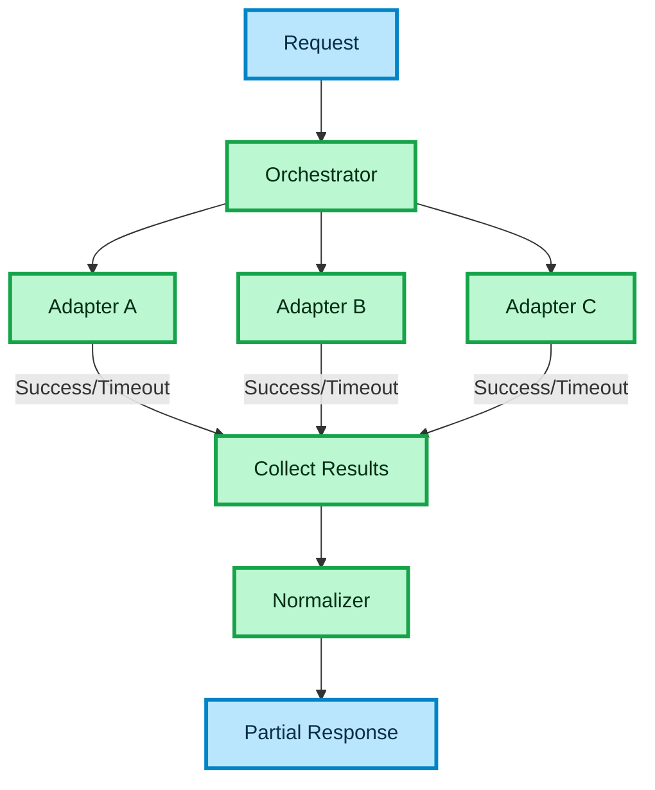
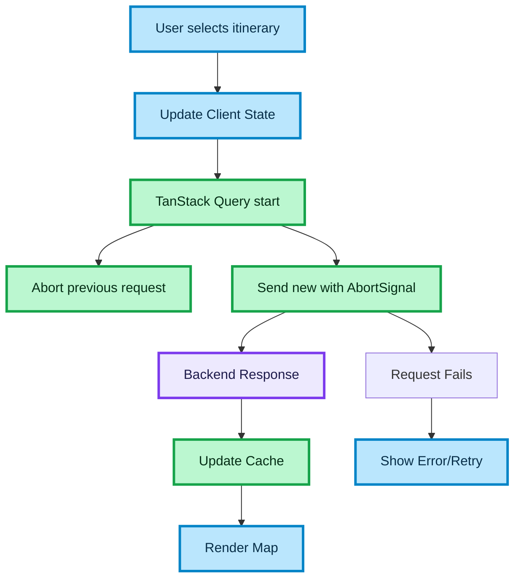

# Map API & System Design Patterns

## Goal

```text
 • Render consistent and correct route geometry for multiple providers with reliable async behavior and good performance.

```

## Decisions

```text
 • Introduce a normalization layer to unify provider data (time, locations, segments)
 •  Use a geometry adapter to isolate map providers and standardize output
 • Add a client-side orchestrator with caching and AbortController to handle async flow and prevent race conditions
```

## Trade-offs

```text
 • Additional layers increase complexity but improve scalability and separation of concerns
 • Client-side caching improves performance but introduces cache management complexity
```

## Why

```text
 • This ensures consistent data flow, prevents stale UI updates, and allows easy integration of new providers in a scalable white-label system.
```

## 🧩 STEP 1: High-Level Architecture

The system follows a standard client-server model with an orchestration layer that communicates with multiple external providers, internal storage, and enrichment services.



**Theory:**

* **Backend:** Acts as the orchestration layer coordinating all requests.
* **Providers:** Primary data sources for transport options.
* **Maps:** Enrichment layer for route geometry and coordinates.
* **Timezone Service:** Resolves offsets for stations to ensure UTC/Local alignment.
* **Cache:** Performance optimization for frequently accessed routes.

---

## 🧩 STEP 2: Orchestration & Normalization Flow

The Orchestrator coordinates multiple adapters and ensures data consistency through several levels of normalization and enrichment.



**Theory:**

* **Normalizer:** Maps provider-specific fields into the internal domain model.
* **Timezone Normalizer:** Resolves offsets for all timestamps (ISO 8601 with offset). It ensures `departureTime` and `arrivalTime` can be compared globally.
* **Location Enricher:** Adds latitude/longitude and station-specific metadata required for map rendering.
* **Pattern:** Multi-stage enrichment preserves original data while preparing it for UI rendering.

---

## 🧩 STEP 3: Timezone Handling Patterns

For cross-border transport, the system must handle the "Arrival Offset" challenge and local display logic.

**Key Requirements:**

* **ISO 8601 with Offset:** Every timestamp must include an offset (e.g., `+02:00`).
* **UTC Comparison:** All sorting and filtering in the Orchestrator happen using UTC-millisecond equivalents.
* **Station Local Time:** The UI must display the local time at the station, not the user's current device time.
* **Next Day Indicator:** If arrival time local offset leads to a different calendar day than departure, the "next day" badge (`+1`) must be computed in the backend.

---

## 🧩 STEP 4: Map / Route Geometry Flow

Geometry (the polyline on the map) is high-payload data and implementation varies by map provider (Google, Mapbox, Deck.gl).



**Theory:**

* **Geometry Adapter:** Normalizes provider formats (Encoded Polyline vs GeoJSON) into a format understood by the white-label map component.
* **Optimization:** Heavy geometry should be fetched lazily (only when a specific itinerary is clicked).
* **Attributions:** The backend/component must extract and pass through provider-required attributions (e.g., "Map data © Google").

---

## 🧩 STEP 5: Partial Failure & Resilience

Resilience is achieved by allowing the system to return partial results when some providers fail or timeout.



**Theory:**

* **Parallelism:** All providers are queried simultaneously.
* **Timeouts:** Per-provider timeouts prevent a single slow source from blocking the entire response.
* **Resilience:** The "Partial Results" pattern ensures the user sees available data regardless of individual failures.

---

## 🧩 STEP 6: Frontend Architecture (React + TanStack Query)

Modern frontend state management simplifies async orchestration and caching.

**Key Features:**

* **TanStack Query:** Handles server state synchronization, caching, and invalidation.
* **Query Keys:** Uses `["route", itineraryId]` to uniquely identify and cache results.
* **Automatic Handling:** Provides built-in loading states, error boundaries, and request deduplication.
* **Geometry Caching:** Heavy route data is cached with a longer `staleTime` than search results to avoid re-fetching on view interaction.

---

## 🧩 STEP 7: Async Control & Cancellation

Using `AbortController` ensures consistent UI state and network efficiency during rapid user interactions.



**Theory:**

* **AbortController:** Prevents "last one wins" bugs where older requests overwrite newer data.
* **Network Efficiency:** Stops unnecessary data transfer for cancelled requests.
* **Predictability:** Ensures that the UI always aligns with the most recent user selection.

---

### 🎨 Legend

#### Node colors

| Color | Meaning |
| :--- | :--- |
| 🔵 **Blue** | Client / UI layer |
| 🟣 **Purple** | Server / external API / infrastructure |
| 🟢 **Green** | Core logic / data processing |
| 🟠 **Orange** | State / cache |
| ⚪ **Gray (pale, dashed border)** | Optional layer / Ignored state |

#### Edge types

| Edge | Meaning |
| :--- | :--- |
| `——→` solid | Core flow — critical path |
| `- - →` dashed | Optional / async — non-blocking |
| `——x` cross | Cancelled / Aborted flow |
