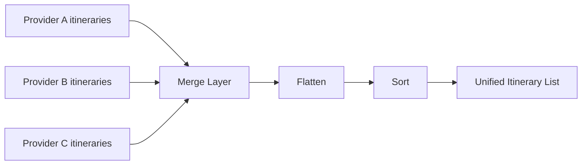

# MERGE PROVIDER ITINERARIES

## Goal

```text
• Support multiple clients and providers with a scalable, configurable architecture while maintaining a consistent user experience.
```

## Decisions

```text
• Use a config-driven architecture to customize behavior per client without changing core logic
• Introduce provider abstraction layer to isolate transport and map providers
• Build reusable UI components with client-specific configuration (branding, features)
• Keep orchestration logic centralized to manage providers and async flow
```

⸻

## Trade-offs

```text
• Increased complexity due to configuration and abstraction layers
• Requires strong contract definitions between layers
```

## Why

```text
• This enables independent scaling of clients and providers, reduces duplication, and allows fast onboarding of new integrations in a white-label system.
```

## Responsibilities

- merge provider results
- remove provider boundaries
- apply global sorting
- return UI-ready list

---

## Input

providers → [{ provider, itineraries[] }]

---

## Output

NormalizedItinerary[]

---

## Flow

providers → flatten → sort → return

---

## Sorting (v1)

- by totalDurationMinutes (asc)

---

## Why this layer exists

- isolates providers from UI
- centralizes sorting logic
- simplifies adding new providers


