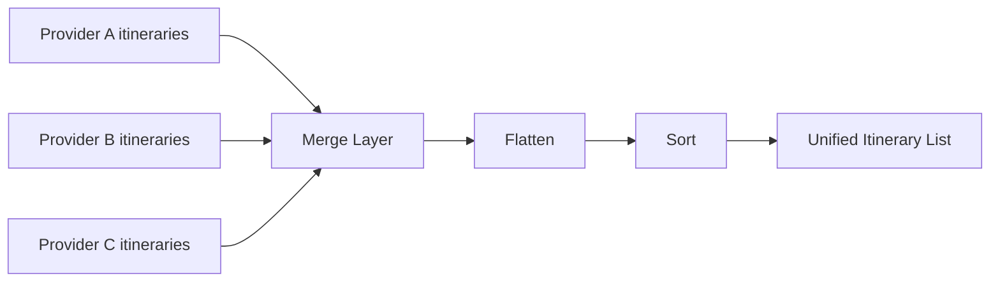

# MERGE PROVIDER ITINERARIES

## Goal

Combine normalized itineraries from multiple providers into a single list for UI.

---

## Responsibilities

- merge provider results
- remove provider boundaries
- apply global sorting
- return UI-ready list

---

## Input

providers → [{ provider, itineraries[] }]

---

## Output

NormalizedItinerary[]

---

## Flow

providers → flatten → sort → return

---

## Sorting (v1)

- by totalDurationMinutes (asc)

---

## Why this layer exists

- isolates providers from UI
- centralizes sorting logic
- simplifies adding new providers

