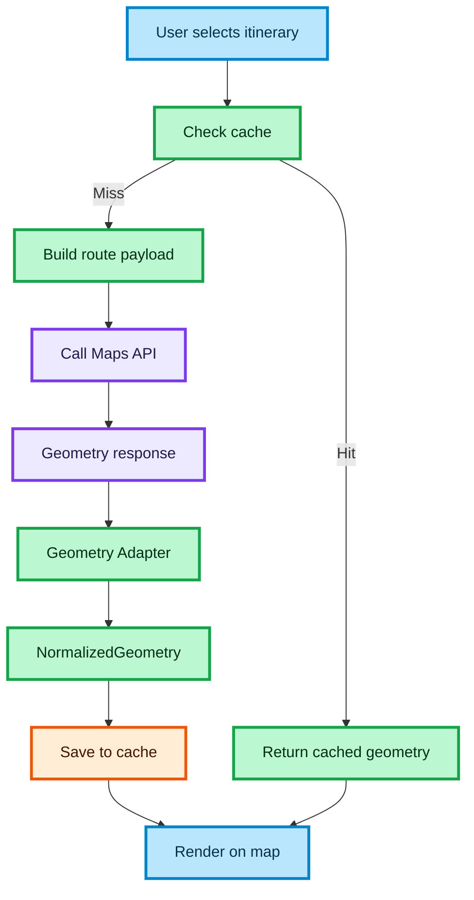

# ROUTE CACHING FLOW

This diagram shows how route geometry caching avoids redundant API calls and improves performance for the white-label transport search.

## How to read this diagram

- The flow starts when a user selects an itinerary
- The system first checks if route geometry is already cached
- If cache hit → return data immediately (no API call)
- If cache miss → build route payload and call Maps API
- The response is normalized via Geometry Adapter
- The result is saved in cache and rendered on the map

### 🎨 Legend

#### Node colors

| Color | Meaning |
| :--- | :--- |
| 🔵 **Blue** | Client / UI layer |
| 🟣 **Purple** | Server / external API / infrastructure |
| 🟢 **Green** | Core logic / data processing |
| 🟠 **Orange** | State / cache |
| ⚪ **Gray (pale, dashed border)** | Optional layer — not in the critical path |

#### Edge types

| Edge | Meaning |
| :--- | :--- |
| `——→` solid | Core flow — critical path |
| `- - →` dashed | Optional / async — non-blocking |
