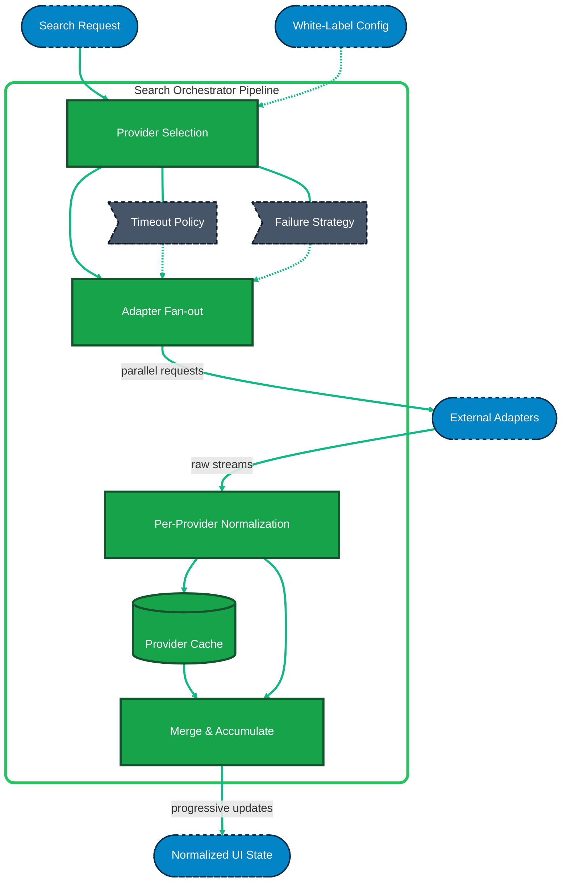

# Search Orchestrator Architecture (Zoom-In)

This document provides a "zoomed-in" view of the **Search Orchestrator** layer from the main transport search architecture.  
It details the internal pipeline that executes when a search request enters the orchestrator, showing exactly how the module handles fan-out, streaming, and resilience without leaking logic to the UI.

## Internal Pipeline Steps

### 1. Provider Selection

Reads the incoming search parameters and applies the `White-Label Config`.  
It decides exactly which transport providers (e.g., Bus, Train, Ferry) should be queried for this specific partner and route (like Dumbledore deciding which magical schools to invite).  
**Why:** prevents unnecessary API calls for disabled integrations.

### 2. Adapter Fan-Out

Takes the list of selected providers and triggers their respective adapters in parallel.  
It passes the normalized search parameters down, waiting for raw data streams to return (like dispatching owl messengers simultaneously in all directions).  
**Why:** isolates the orchestration from the low-level HTTP and provider-specific contracts.

### 3. Per-Provider Normalization

Processes raw payloads into the shared domain shape **immediately** as each provider responds.  
Instead of gathering all responses in a single batch, the orchestrator normalizes them on the fly (like translating each foreign scroll the moment the owl drops it).  
**Why:** eliminates the "wait-for-all" bottleneck, enabling progressive UI updates.

### 4. Provider Cache

Stores the normalized results for each provider independently, **before** the final merge.  
If a specific API fails on a subsequent search, the orchestrator can pull stale routes for that provider while fetching fresh data for others (like using an old potion recipe when fresh ingredients are delayed).  
**Why:** per-provider cache dramatically increases resilience compared to caching one massive merged array.

### 5. Merge & Accumulate

Adds the newly normalized provider results to the existing result list in memory.  
It incrementally sorts and updates the main response, yielding partial arrays back to the Search Hook (like arranging arriving participants into the official list as they enter the hall).  
**Why:** supports streaming and progressive results without causing layout shifts or blocking delays.

---

## Resilience & Policies (Ghost Layers)

The orchestrator wraps the execution steps with stability policies to protect the UI.

### Timeout Policy

Limits how long the orchestrator waits for any single adapter.  
If the Ferry API hangs for 30 seconds, the orchestrator aborts that specific promise (`Promise.race`) and proceeds with Bus and Train results.  
**Why:** prevents one slow integration from blocking the entire search experience.

### Failure Strategy

Catches errors from individual adapters.  
Instead of rejecting the entire search orchestrator promise, it logs the error, returns a partial dataset, and warns the user.  
**Why:** in B2B transport systems, partial results are always better than a total crash.

### Retry Policy

Defines safe conditions for retrying failed adapter calls (e.g., network timeout vs 401 Unauthorized).  
**Why:** improves success rates for flaky external APIs invisibly to the UI.

---

## Architecture Diagram

### 🎨 Legend

| Styling | Meaning |
| :--- | :--- |
| 🟢 **Green (Solid)** | Internal Orchestrator Pipeline Steps. |
| ⚫ **Dark Gray (Dashed)** | Internal Resilience Policies (Ghost layers). |
| 🔵 **Blue (Dashed)** | External Inputs / Outputs (UI, Config, Adapters). |
