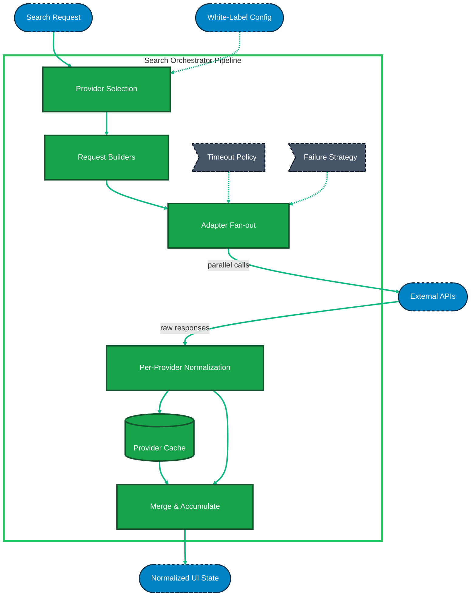

# Search Orchestrator Architecture (Zoom-In)

This document provides a "zoomed-in" view of the **Search Orchestrator** layer from the main transport search architecture.  
It details the internal pipeline that executes when a search request enters the orchestrator, including **request builders**, adapter fan-out, normalization, and resilience handling.

---

## Internal Pipeline Steps

### 1. Provider Selection

Reads the incoming search parameters and applies the `White-Label Config`.  
It decides exactly which transport providers (e.g., Bus, Train, Ferry) should be queried (like Dumbledore choosing which magical schools to invite).  
**Why:** avoids unnecessary API calls and keeps orchestration deterministic.

---

### 2. Request Builders (Provider Mapping Layer)

Transforms **TransportSearchParams → Provider-specific params → URLSearchParams**.  
Each provider has its own mapper and query builder (like translating one spell into different magical dialects).

Example:

- `mapTransportSearchToBusParams`
- `buildBusQueryParams`

**Why:** isolates provider contracts and prevents them from leaking into orchestrator or UI.

---

### 3. Adapter Fan-Out

Triggers all selected provider adapters in parallel using the same domain input.  
Each adapter internally uses its builder to prepare the request and call the API (like sending multiple owls at once, each speaking its own language).  
**Why:** enables parallel execution and keeps orchestrator unaware of HTTP details.

---

### 4. Per-Provider Normalization

Each adapter response is normalized immediately into `TransportSearchResult[]`.  
Normalization happens per provider without waiting for others (like translating scrolls the moment they arrive).  
**Why:** removes "wait-for-all" bottleneck and prepares data for merging.

---

### 5. Provider Cache

Stores normalized results per provider before merging.  
If one provider fails later, cached data can still be used (like reusing an old potion when ingredients are missing).  
**Why:** improves resilience and reduces dependency on live API availability.

---

### 6. Merge & Accumulate

Combines normalized results into a single array.  
With current implementation (`Promise.allSettled`), only fulfilled results are merged (like assembling a list from the messengers who successfully returned).  
**Why:** supports partial results and keeps UI responsive even under failure.

---

## Resilience & Policies (Ghost Layers)

### Timeout Policy

Limits execution time of each provider request.  
If one provider is too slow, it gets cancelled while others continue (like abandoning a delayed owl).  
**Why:** prevents long blocking operations.

---

### Failure Strategy

Uses `Promise.allSettled` to collect all results without failing the entire flow.  
Failed providers are logged, while successful ones are returned (like ignoring lost messages but continuing the mission).  
**Why:** ensures partial results instead of total failure.

---

### Retry Policy

Defines retry conditions for transient errors (e.g., network issues).  
Should be implemented at adapter or orchestrator level.  
**Why:** increases robustness for unreliable APIs.

---

## Recommended Boundary

- Orchestrator = coordination + resilience
- Builders = provider request mapping
- Adapters = API execution
- Normalizers = response mapping

This separation ensures clean architecture and testability (like separating spell casting, translation, and execution across different magical roles).

---

### 🎨 Legend

| Styling | Meaning |
| :--- | :--- |
| 🟢 **Green (Solid)** | Internal Orchestrator Pipeline Steps. |
| ⚫ **Dark Gray (Dashed)** | Internal Resilience Policies (Ghost layers). |
| 🔵 **Blue (Dashed)** | External Inputs / Outputs (UI, Config, Adapters). |
