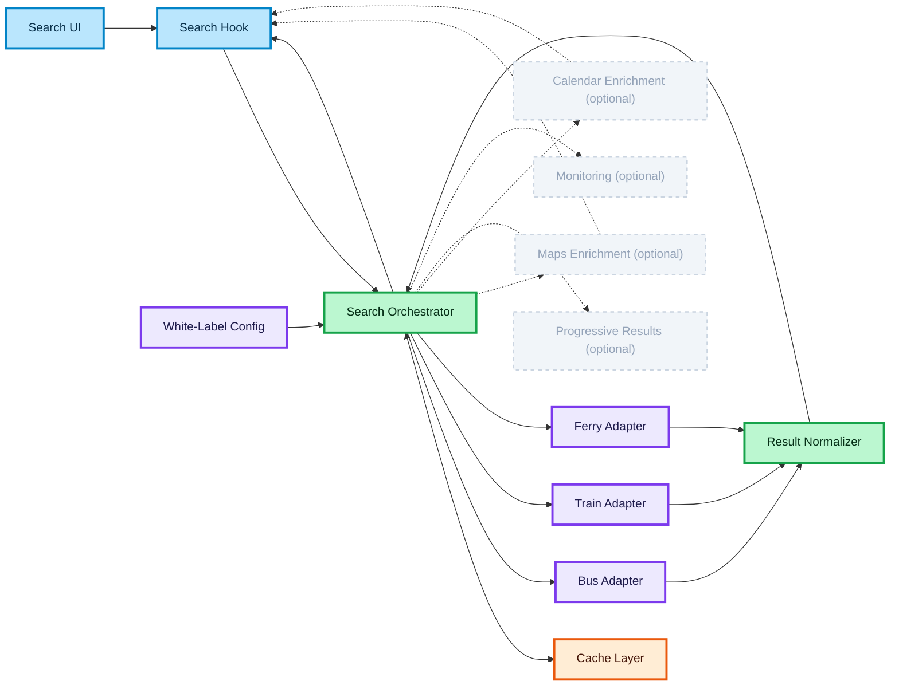

# White-Label Transport Search Architecture

This page defines a practice architecture for a white-label transport search experience embedded into a partner product.  
The goal is to model how the frontend coordinates search UI, orchestration, provider integrations, and normalized results.

## Search UI

The Search UI is the entry point where the traveler enters origin, destination, date, and passengers.  
It should remain presentation-focused and delegate orchestration to hooks and services (like Harry holding the wand, but not controlling the magic directly).  
**Why:** The UI shouldn't know about the API → less coupling.

## Search Hook (includes Request Control)

The Search Hook manages async state (loading, error, data) and internally handles request control such as debounce, cancellation, and "latest request wins" logic (like Hermione controlling spells and preventing them from exploding).  
**Why:** The UI works with a stable state, while all request complexity is isolated.

## Search Orchestrator

The Search Orchestrator is the decision boundary of the system.  
It selects providers from config, performs fan-out requests, merges results, applies sorting and ranking, and returns a consistent UI model (like Dumbledore coordinating all magical processes).  
**Why:** Centralizes business logic and manages complexity.

## Provider Adapters

Provider Adapters isolate each external API behind a unified interface.  
They handle authentication, headers, rate limits, and map raw responses to a normalized structure (like translators of magical languages).  
**Why:** Isolates API instability and contract changes.

## Result Normalizer

The Result Normalizer converts provider-specific data into a shared domain model.  
It ensures all providers produce consistent output (like transforming different spells into a single unified form).  
**Why:** The UI doesn't depend on specific APIs.

## Cache Layer (inside Orchestrator boundary)

The Cache Layer stores normalized and merged results.  
It is used by the orchestrator to prevent repeated fan-out calls (like a magical memory of results).  
**Why:** Caching only makes sense after aggregation.

## Maps Enrichment (async layer)

Maps Enrichment enhances results with route visualization and location context.  
It runs independently and updates the UI progressively (like the Marauder's Map appearing later).  
**Why:** Doesn't block the core results.

## Calendar Enrichment (async layer)

Calendar Enrichment provides nearby date insights and pricing variations.  
It runs independently from the core search flow (like predicting the future).  
**Why:** Secondary data → shouldn't block the UX.

## White-Label Config (control plane)

White-Label Config defines enabled providers, integrations, and partner-specific behavior.  
It can be runtime (API/CDN) or build-time (env config) (like the rules of different magical schools).  
**Why:** Allows scaling the product for different clients.

## Failure Handling (inside Orchestrator)

Failure handling is implemented as a strategy inside the orchestrator.  
If one provider fails, the system returns partial results instead of failing completely (like protection against a broken spell).  
**Why:** Resilience is more important than a perfect response.

## Progressive Results (Ghost Layer)

Progressive results allow partial data to appear as providers respond.  
Faster providers render first, slower ones append later (like magic revealing itself gradually).  
**Why:** Improves perceived performance.

## Monitoring & Analytics (Ghost Layer)

Monitoring tracks latency, failures, and provider reliability.  
It is not part of the core flow but ensures system observability (like controlling the state of the magical world).  
**Why:** Production stability.

## Recommended Boundary

The orchestrator is the central decision layer.  
It coordinates providers, applies business logic, and returns a stable result model (like the center of magic control).  
**Why:** A clear signal of senior-level design.

### 🎨 Legend

#### Node colors

| Color | Meaning |
| :--- | :--- |
| 🔵 **Blue** | Client / UI layer |
| 🟣 **Purple** | Server / external API / infrastructure |
| 🟢 **Green** | Core logic / data processing |
| 🟠 **Orange** | State / cache |
| ⚪ **Gray (pale, dashed border)** | Optional layer — not in the critical path |

> **Note:** Failure handling has no separate node — it is a resilience **strategy inside the Orchestrator** (green).

#### Edge types

| Edge | Meaning |
| :--- | :--- |
| `——→` solid | Core flow — critical path |
| `- - →` dashed | Optional / async — non-blocking |
