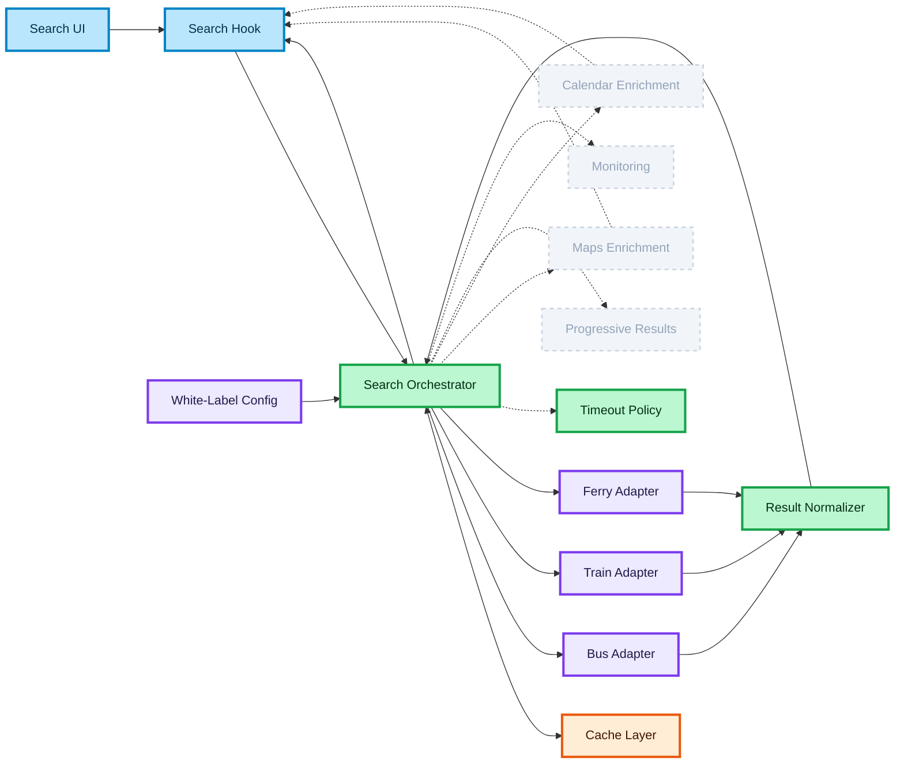

# White-Label Transport Search Architecture

This page defines a high-level architecture for a white-label transport search experience.  
It focuses on how the frontend coordinates UI, orchestration, providers, and normalized results without exposing implementation details.

## Search UI

The Search UI collects user input (from, to, date, passengers) and triggers search execution.  
It delegates all logic to hooks and services (like Harry holding the wand, but not controlling the magic directly).  
**Why:** keeps UI simple and decoupled from business logic.

## Search Hook

The Search Hook manages async state (loading, error, data) and connects UI to the orchestrator.  
It encapsulates request lifecycle concerns (like Hermione stabilizing spell execution).  
**Why:** provides a stable interface between UI and data layer.

## Search Orchestrator

The Search Orchestrator is the central decision layer.  
It selects providers, executes parallel requests, applies timeout policies, merges results, and returns a consistent model (like Dumbledore coordinating all magic).  
**Why:** centralizes business logic and controls complexity.

## Provider Adapters

Provider Adapters isolate each external API behind a unified interface.  
They handle request building, authentication, and API communication (like translators between magical worlds).  
**Why:** protects the system from API variability.

## Result Normalizer

The Result Normalizer converts raw provider responses into a shared domain model.  
It ensures consistency across all providers (like transforming different spells into one language).  
**Why:** prevents UI dependency on external contracts.

## Cache Layer (inside Orchestrator)

The Cache Layer stores normalized provider results and merged outputs.  
It is used for fallback and performance optimization (like a magical memory of past searches).  
**Why:** improves resilience and reduces repeated requests.

## Timeout Policy (inside Orchestrator)

Timeout policy limits how long each provider request can run.  
Slow providers are safely ignored while others continue (like abandoning a lost owl).  
**Why:** prevents one provider from blocking the entire search.

## Maps Enrichment (optional)

Adds route visualization and geospatial context asynchronously.  
It updates UI after core results are available (like revealing the Marauder’s Map later).  
**Why:** non-critical enhancement layer.

## Calendar Enrichment (optional)

Provides nearby date insights and pricing variations.  
Runs independently from the main search flow (like glimpses into the future).  
**Why:** secondary data should not block results.

## White-Label Config

Defines enabled providers and partner-specific behavior.  
Can be runtime or build-time configuration (like rules of different magical schools).  
**Why:** supports multiple clients with one system.

## Failure Handling (inside Orchestrator)

Handles provider failures without breaking the entire flow.  
Returns partial results when needed (like shielding against broken spells).  
**Why:** resilience over perfection.

## Progressive Results (Ghost Layer)

Allows results to appear as soon as providers respond.  
Faster providers render first (like magic revealing itself step by step).  
**Why:** improves perceived performance.

## Monitoring (Ghost Layer)

Tracks latency, failures, and provider reliability.  
Not part of core flow (like observing the magical system).  
**Why:** ensures production stability.

## Recommended Boundary

The orchestrator is the system’s control center.  
It coordinates providers, applies policies, and returns a stable model (like the core of magical control).  
**Why:** clear separation of concerns and strong system design signal.

### 🎨 Legend

#### Node colors

| Color | Meaning |
| :--- | :--- |
| 🔵 **Blue** | Client / UI layer |
| 🟣 **Purple** | Server / external API / infrastructure |
| 🟢 **Green** | Core logic / data processing |
| 🟠 **Orange** | State / cache |
| ⚪ **Gray (pale, dashed border)** | Optional layer — not in the critical path |

> **Note:** Failure handling has no separate node — it is a resilience **strategy inside the Orchestrator** (green).

#### Edge types

| Edge | Meaning |
| :--- | :--- |
| `——→` solid | Core flow — critical path |
| `- - →` dashed | Optional / async — non-blocking |
