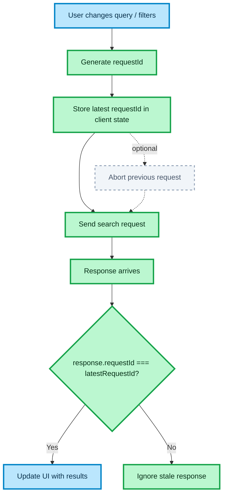

# FRONTEND STALE RESPONSE HANDLING

This document describes the frontend architecture for preventing stale search responses from overwriting the latest user intent.

The goal is to ensure that rapid query or filter changes do not produce inconsistent UI state.

## How to read this diagram

- The flow starts when the user changes search input
- Each outgoing request receives a unique `requestId`
- The latest active `requestId` is stored in client state
- When a response arrives, the UI compares its `requestId` with the latest active one
- If the response is stale, it is ignored
- If the response matches the latest request, the UI is updated
- Optionally, the previous request can be cancelled with `AbortController`

## Key architectural concepts

### Request identity

Each search request must have a unique identifier so that the UI can distinguish fresh responses from stale ones.

### Latest request wins

Only the response belonging to the latest active request is allowed to update client state.

### Client-side async control

The stale response check lives in the frontend orchestration layer, not in presentational components.

### Optional cancellation

`AbortController` can be used to cancel in-flight requests when the user changes input quickly.

### Stable UI contract

The UI should always reflect the latest user input, even if older requests resolve later.

## Outcome

- Predictable search UI under rapid input changes
- No stale results rendered after newer input
- Safer async state handling
- Better user experience during fast interactions

