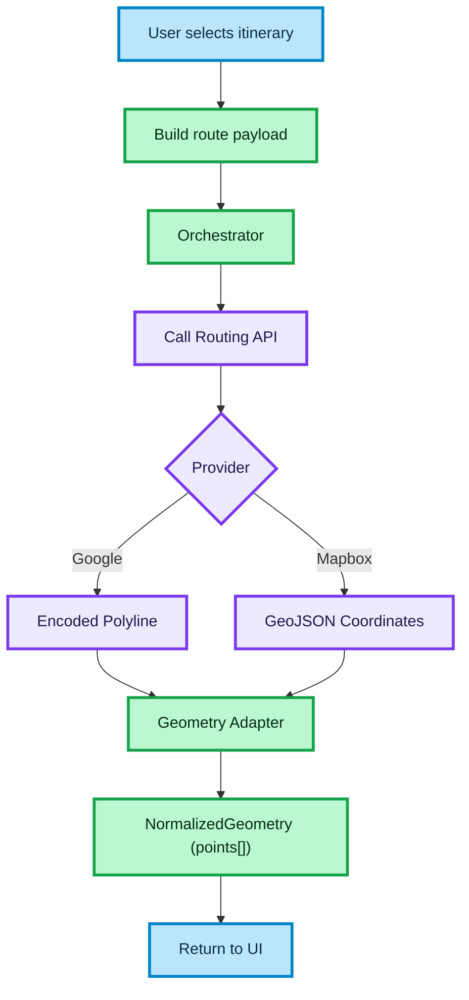

# GEOMETRY ADAPTER AND UNIFIED MAP ROUTING INTEGRATION

This document describes the architecture for integrating multiple map providers (e.g., Google Maps, Mapbox) into a unified routing system.

The goal is to ensure that all route geometry returned from external providers is normalized into a consistent format that can be safely consumed by the frontend.

## How to read this diagram

- The flow starts when a user selects an itinerary
- The system builds a route payload from normalized transport data
- The orchestrator calls a provider-specific routing API
- Each provider returns geometry in a different format:
  - Google → Encoded Polyline
  - Mapbox → GeoJSON coordinates
- The Geometry Adapter transforms provider-specific formats into a unified structure
- The final output is a stable `NormalizedGeometry` object used by the frontend map

## Key architectural concepts

### Provider abstraction

Routing providers are isolated behind a common interface. The system does not depend on provider-specific formats outside the adapter layer.

### Geometry normalization

All geometry data is transformed into a unified structure:

- `{ lat, lng }[]`
- no provider-specific fields

### Orchestration layer

The orchestration layer:

- coordinates payload building
- calls the routing provider
- applies geometry normalization
- integrates caching and request control

### Compatibility with normalization layer

The routing system consumes normalized transport data:

- locations → `{ lat, lng, id }`
- segments → consistent structure
- time → ISO format

### Frontend contract

The frontend receives:

- stable geometry format
- no knowledge of provider differences
- predictable structure for rendering

## Outcome

- Provider-agnostic routing system
- Consistent geometry format across all providers
- Clean separation of concerns
- Scalable architecture for adding new providers

