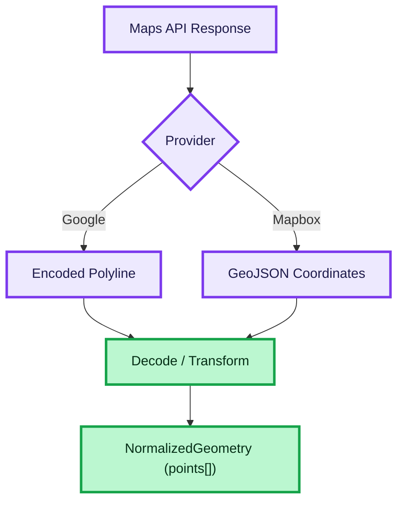

# GEOMETRY ADAPTER

This diagram shows how different map provider responses are normalized into a unified geometry format.

## How to read this diagram

- The system receives geometry from different providers
- Each provider returns a different format:
  - Google → encoded polyline
  - Mapbox → GeoJSON coordinates
- The adapter converts each format into a unified structure
- The UI works only with normalized geometry

