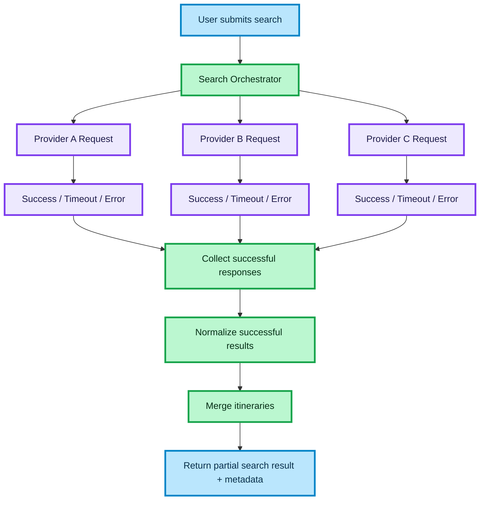

# PARTIAL FAILURE HANDLING FOR MULTI-PROVIDER SEARCH

This document describes the architecture for handling partial failures in a multi-provider transport search system.

The goal is to keep search responsive and return usable results even when one or more providers fail, timeout, or degrade.

## How to read this diagram

- The flow starts when the user submits a search request
- The orchestrator sends requests to multiple providers in parallel
- Each provider can return:
  - success
  - timeout
  - error
- Only successful responses are passed into the normalization layer
- Failed or timed out providers are tracked as partial failures
- The system returns partial results together with metadata about incomplete coverage

## Key architectural concepts

### Parallel orchestration

The orchestrator executes provider requests in parallel to reduce total latency and avoid one provider blocking the whole flow.

### Per-provider timeout

Each provider request is limited independently so that one slow integration does not delay the full search response.

### Partial failure model

Timeouts and provider errors are treated as degraded outcomes, not as full search failure.

### Normalization boundary

Only successful provider responses are normalized and merged into the final itinerary list.

### Search health metadata

The result may include metadata such as:

- `partial`
- `failedProviders`
- `timedOutProviders`

### Frontend contract

The frontend receives:

- usable itineraries
- stable result shape
- optional metadata for soft warning or observability
- no provider-specific error handling logic

