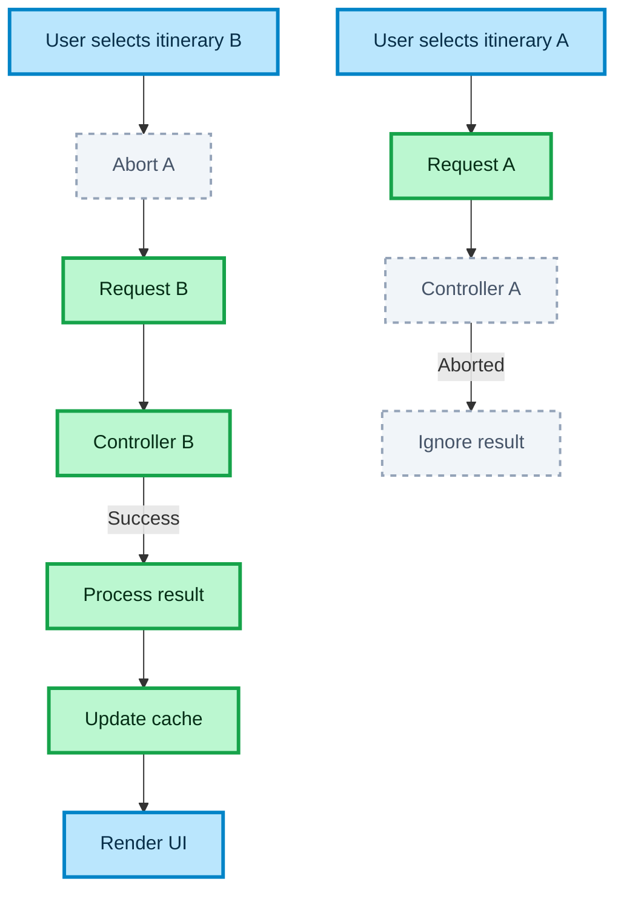

# RACE CONDITIONS AND ABORT FLOW

This diagram shows how the system prevents stale responses from overriding the latest user action.

## How to read this diagram

- The user triggers multiple requests by selecting different itineraries
- Each new request cancels the previous one
- Only the latest request is allowed to complete
- Aborted requests are ignored and do not affect state or cache
- This guarantees correct UI behavior

