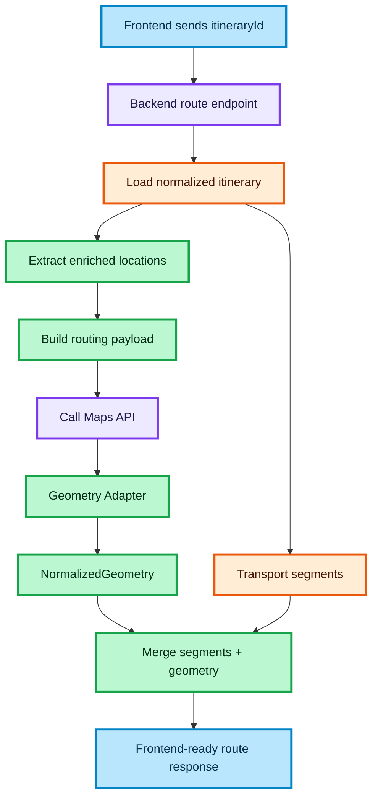

# ROUTE BUILDING FLOW WITH MAP GEOMETRY ENRICHMENT

This document describes the backend route-building flow that converts a selected itinerary into a map-ready route response.

The goal is to combine transport segment data with routing geometry and return a stable, frontend-ready payload for map rendering.

## How to read this diagram

- The flow starts when the frontend sends `itineraryId`
- The backend retrieves the normalized itinerary from the source of truth
- The system extracts enriched locations (`lat`, `lng`, `locationId`) from itinerary segments
- A routing payload is built from the ordered route points
- The backend calls an external Maps API to fetch geometry
- The Geometry Adapter normalizes provider-specific geometry into a unified format
- The backend merges transport segments with normalized geometry
- The final result is returned as a map-ready response for the frontend

## Key architectural concepts

### Source of truth

The selected itinerary is retrieved by `itineraryId` from cache or database. This ensures the route is built from normalized, trusted data rather than from frontend-provided raw payloads.

### Route payload building

The backend derives routing input from transport segments by extracting ordered points from enriched locations.

### Geometry enrichment

The backend fetches route geometry from an external Maps API and normalizes the response into a stable internal contract.

### Merge step

Transport segment data and geometry are combined into a single response object so the frontend does not need to reconcile them manually.

### Frontend contract

The frontend receives:

- normalized segments
- normalized geometry
- one stable response shape
- no provider-specific routing details

## Outcome

- Reliable backend route-building pipeline
- Unified geometry contract across providers
- Stable map-ready response for frontend rendering
- Clean separation between transport data, routing providers, and UI

