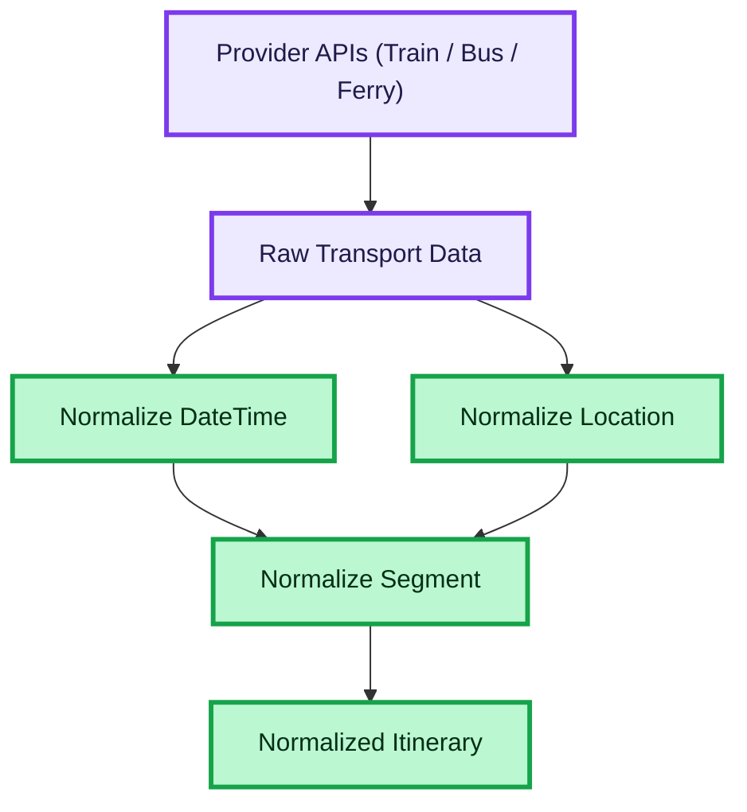

# ROUTE DATA NORMALIZATION

This diagram shows how raw transport provider data is normalized into a consistent domain model used across the system.

## How to read this diagram

- The flow starts with raw data coming from multiple transport providers
- Each provider may return different formats (timezones, structures, naming)
- The system normalizes:
  - date/time into ISO format with timezone
  - locations into consistent shape (id, name, lat, lng)
  - segments into unified transport segments
- Normalized segments are combined into itineraries
- The result is a consistent, provider-agnostic data structure used by the UI and further processing layers

