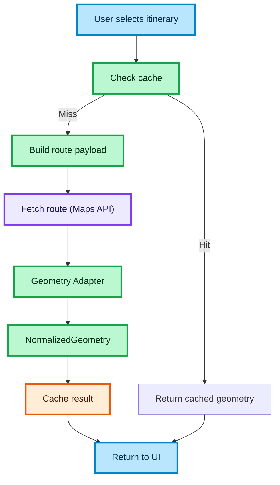

# ROUTE ORCHESTRATION FLOW

This diagram shows how route data is fetched, normalized, cached, and returned to the UI.

## How to read this diagram

- The flow starts when a user selects an itinerary
- The system checks cache first
- If not cached:
  - builds route payload
  - calls Maps API
  - normalizes geometry
- The result is cached and returned
- This layer orchestrates all steps into a single flow

