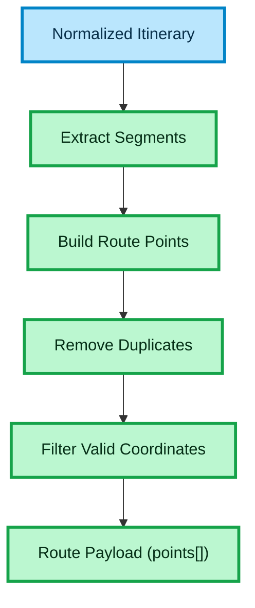

# ROUTE PAYLOAD BUILDING

This diagram shows how a normalized itinerary is transformed into a routing payload for map providers.

## How to read this diagram

- The flow starts with a normalized itinerary
- The system extracts ordered segments
- It builds a sequence of route points:
  - origin of the first segment
  - destination of each segment
- Duplicate consecutive points are removed
- Only valid coordinates are included
- The result is a clean list of points ready for Maps API

